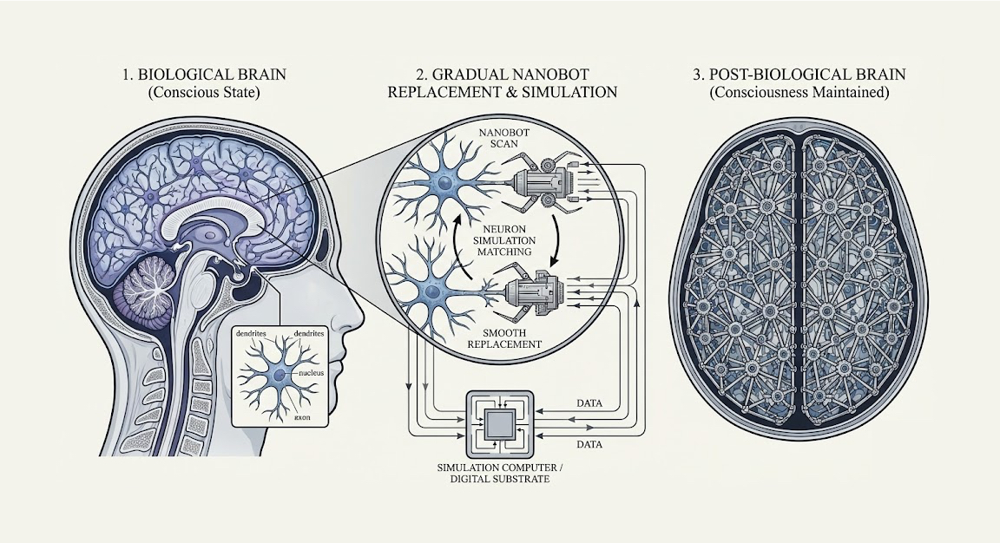

#core/artificialintelligence 

Proposed by Dr [Hans Moravec](https://everything2.com/title/Hans+Moravec "Hans Moravec") in the book [Mind Children](https://everything2.com/title/Mind+Children "Mind Children"), this describes how a **human brain could be transformed into a mechanical structure made from nanobots** without the brain in question losing consciousness.
  
A neuron-sized robot swims up to a neuron and scans it into memory. A computer starts simulating the neuron. The robot waits until the neuron perfectly matches its simulation inside the computer and then **replaces the neuron with itself as smoothly as possible,** sending inputs to the computer and transmitting outputs from the simulation of a neuron inside the computer.  
  
This entire procedure has had no effect on the flow of information of the brain except that one neuron's worth of processing is now being done inside a computer instead of a neuron. Repeat, neuron by neuron, until the entire brain is composed of robot neurons whose guts are inside the computer.

## Comparison with Ectopic Cognitive Preservation

The Moravec transfer is fundamentally a **digitisation** procedure: computation moves *out of* biological tissue into an external simulation computer, with nanobots serving as I/O relays. This contrasts with [Ectopic Cognitive Preservation](../../_general/psnst.md) (ECP), which performs a **substrate migration** — biological tissue is replaced by engineered biological (or de novo synthetic) tissue that retains intrinsic computational properties.

| | Moravec Transfer | [ECP](../../_general/psnst.md) |
|---|---|---|
| **Replacement unit** | Individual neuron → digital simulation | Tissue layers → synthetic biological substrate |
| **Where computation lives** | External simulation computer | The synthetic substrate itself |
| **Requires [Biomimetic neuromorphics](../../../002_profession/eightsix-science/biomimetic_neuromorphics.md)** | No — substrate is conventional silicon | Yes — replacement tissue must be functionally equivalent |
| **Transfer mechanism** | Functional simulation matching | Neuroplastic cortical reorganisation |
| **Granularity** | Neuron-by-neuron | Layer-by-layer (cortical laminar approach) |
| **End state** | Robotic lattice relaying to a computer | Distributable synthetic neural tissue |

Because computation remains *in tissue* under ECP, the replacement substrate must satisfy the [invariance criterion](../../../002_profession/eightsix-science/invariant_brain_emulation.md) ($O(f(b)) \equiv O(b)$) — a requirement that [biomimetic neuromorphics](../../../002_profession/eightsix-science/biomimetic_neuromorphics.md) addresses. Moravec's approach sidesteps this by outsourcing computation entirely, but in doing so may fail to preserve intrinsic causal structure, which [IIT](../../videos/integrated_information_theory.md) argues is necessary for [phenomenal consciousness](../../videos/access_and_phenomenal_consciousness.md).

Both approaches share philosophical lineage in [Chalmers' organisational invariance](../../books/from_biological_to_artificial_consciousness/fading_qualia.md) argument and the Ship of Theseus intuition, but ECP is a more biologically grounded descendant — requiring advances in [bioprinting](../../../003_education/kings-college/05_neuroscience_in_society/bioprinting.md), optogenetics, and substrate engineering rather than speculative nanobot technology.