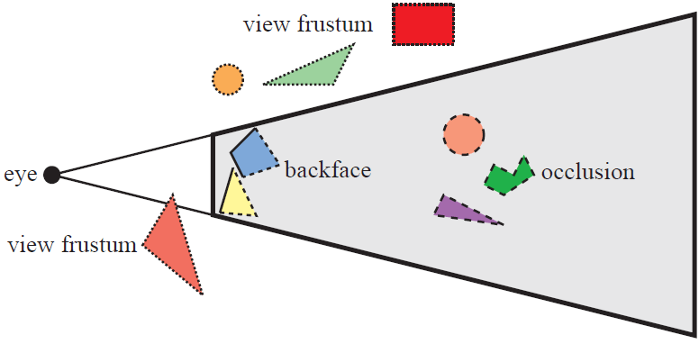

#core/softwaredevelopment

Frustum culling is a **performance optimisation technique used in 3D graphics** to improve rendering efficiency. It involves **determining whether or not a geometric object is within a camera's viewable region (frustum).** If an object is outside this frustum, it is not rendered, saving computational resources.

## How It Works

The frustum is the six-sided volume defined by the camera's position, field of view, aspect ratio, and near/far clipping planes. Each frame, every object's [bounding volume](../../004_subsidiary/courses/threejs_journey/collider_types.md) (typically a sphere or axis-aligned box) is tested against this volume — a cheap mathematical check compared to the cost of issuing draw calls, running vertex shaders, and rasterising geometry. Objects that fail the test are skipped entirely by the render pipeline.

Culling only helps if the check is cheaper than the drawing — hence coarse bounding volumes rather than per-triangle tests, and spatial data structures (BSP trees, octrees) to avoid testing every object against every camera.

## Why It Matters

- **Scalability**: scene complexity becomes decoupled from per-frame cost — a city with a million polygons renders like one with ten thousand visible.
- **The general pattern**: culling is one instance of the broader optimisation strategy of *not computing what cannot affect the output*, alongside occlusion culling (hidden behind other objects), back-face culling (facing away), and level-of-detail switching.

## Related

- [collider_types](../../004_subsidiary/courses/threejs_journey/collider_types.md) — bounding volumes of the kind used in culling tests, from the Three.js Journey notes
- [half_extend](../../004_subsidiary/courses/threejs_journey/half_extend.md) — sibling Three.js geometry note
