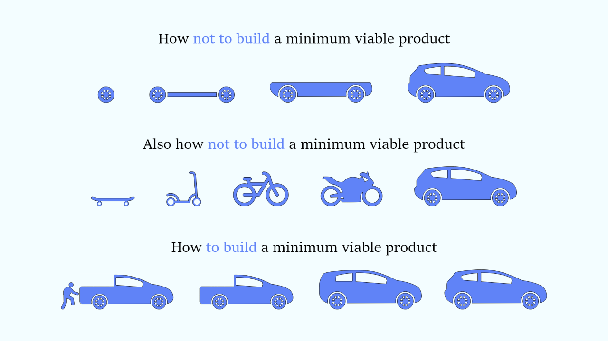

#core/softwaredevelopment

A minimal working example (MWE) is the **most stripped-down version of code that still reproduces a desired outcome or bug**, used to isolate a problem so it can be understood, shared, and solved quickly. Also known as a *minimal reproducible example* (or "reprex" in the R community), it embodies simplicity and focus when demonstrating a specific problem or question.

## Characteristics of an MWE

- **Simplicity:** Contains only the essential code or steps needed to reproduce the issue, devoid of any extraneous details or complexities.
- **Self-contained:** Can be executed or understood independently without requiring additional [context](../../../002_profession/eightsix/wiki/experiments/001_graft-implant-pre-pilot/context.md), settings, or dependencies. This makes it easily shareable and understandable by others.
- **Focused:** Directly targets a specific problem or question, ensuring that the example is directly relevant to the issue at hand.

## Creating an MWE

1. **Isolate the Problem:** Start by stripping away any part of your project or code that is not related to the issue.
2. **Simplify:** Reduce your code or project to the bare minimum required to reproduce the problem or demonstrate the concept.
3. **Verify:** Ensure that the MWE still reproduces the issue or adequately demonstrates the concept you're focused on.
4. **Document:** Clearly comment on your code or provide explanations to guide others through your MWE, highlighting the area of interest.

## Why It Works

Constructing an MWE is a form of [structured hypothesis testing](../../books/essential_math_for_data_science/structured_hypothesis_testing.md): each deletion tests whether the removed code was necessary for the bug to appear. The process frequently reveals the root cause before the question is even asked — the same phenomenon behind rubber-duck debugging. It also respects the time of those helping: a runnable, focused example lowers the barrier to answering and typically yields faster, more precise solutions.

## Related Concepts

- [Structured Hypothesis Testing](../../books/essential_math_for_data_science/structured_hypothesis_testing.md) — the same eliminate-and-test discipline applied to data
- [Inductive and Deductive Reasoning](inductive_and_deductive_reasoning.md) — an MWE converts vague inductive suspicion ("something in my project is broken") into a deductive, testable claim
