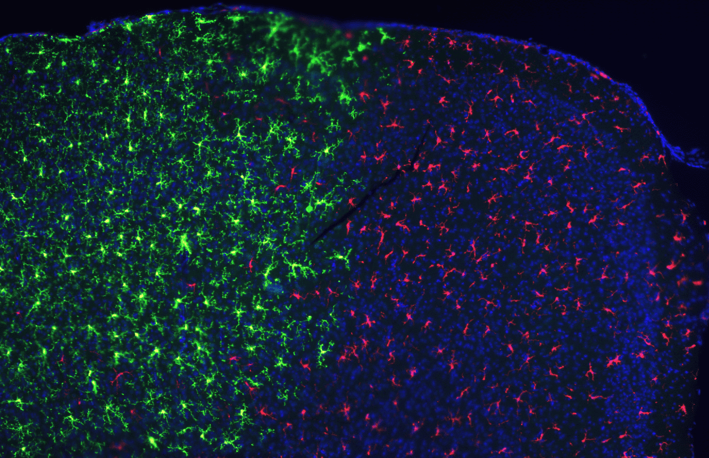

#core/appliedneuroscience #core/artificialintelligence

Neural grafts, also known as neural tissue transplantation or neural implants, involve the **surgical transplantation of neural cells or tissue into the brain** or spinal cord.

The transplanted neural tissue can be derived from various sources, including:
- **Fetal brain tissue:** Neural stem cells or progenitor cells obtained from fetal brain tissue have the potential to differentiate into various neural cell types, such as neurons, astrocytes, and oligodendrocytes.
- **Embryonic stem cells (ESCs):** ESCs are pluripotent stem cells derived from the inner cell mass of a blastocyst. They have the ability to differentiate into any cell type, including neural cells, through specific differentiation protocols.
- **Induced pluripotent stem cells (iPSCs):** iPSCs are generated by reprogramming adult somatic cells, such as skin fibroblasts or blood cells, back to a pluripotent state. Like ESCs, they can be differentiated into neural cells for transplantation.
- **Adult stem cells:** Certain regions of the adult brain, such as the subventricular zone and the hippocampal dentate gyrus, contain neural stem cells that can be isolated and expanded for transplantation. The transplanted neural cells or tissue are intended to replace or repair damaged or diseased neural tissue in the recipient’s brain or spinal cord.

The goal is to restore lost functions or alleviate symptoms associated with various neurological disorders, such as Parkinson’s disease, Huntington’s disease, stroke, spinal cord injury, and neurodegenerative diseases. The success of neural grafts depends on several factors, including the survival and integration of the transplanted cells, the formation of appropriate neural connections, and the ability of the transplanted cells to replace or support the function of the damaged neural tissue.
