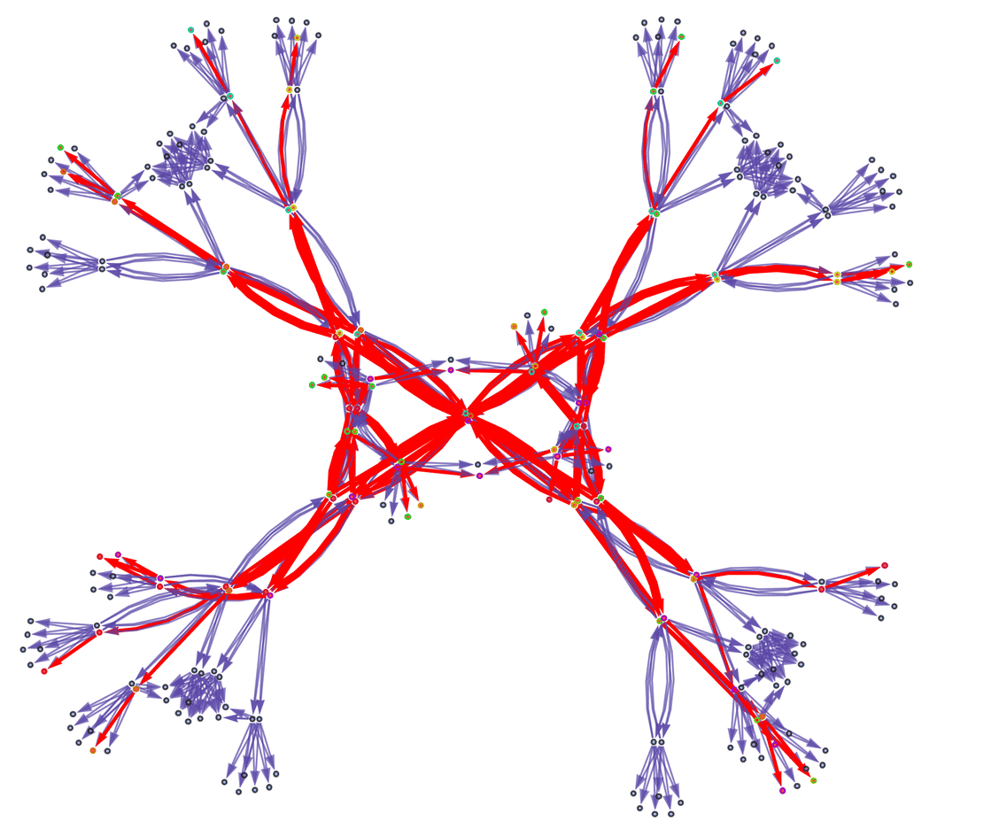

#core/mathematicalphysics

## Definition and Concept

1. **Universal Computational Structure**: The ruliad is envisioned as a universal computational structure that encompasses all possible computational rules and their evolutions. It is a mathematical object that represents the collection of all conceivable computations and their results.
2. **Rules and Computations**: In Wolfram’s framework, the universe is fundamentally computational. The ruliad is the set of all possible rules (or programs) and the computations they generate. Each rule specifies how to transform a set of initial conditions into a new state, and the ruliad includes every possible rule and every possible sequence of transformations.
3. **Comprehensive and Infinite**: The ruliad is comprehensive in the sense that it includes every possible way to evolve a system according to any rule. It is infinite because the number of possible rules and the sequences they generate are unbounded.

## Implications

1. **Physics and Reality**: Wolfram suggests that our physical universe is a slice of the ruliad. The specific rules that govern our universe are just one set of rules within the ruliad. By studying the ruliad, we can gain insights into why our universe has the particular properties it does.

2. **Multiverse and Observers**: The concept also ties into ideas about the multiverse. Different observers might experience different “slices” of the ruliad based on their own computational processes. This means that what we perceive as reality is just one perspective within the vast computational structure of the ruliad.

3. **Computational [Irreducibility](Computational%20irreducibility.md)**: One of Wolfram’s key ideas is that many computational processes are irreducible, meaning their outcomes cannot be predicted without actually performing the computation. The ruliad, being the totality of all computations, inherently includes this irreducibility.

## Applications

- **Fundamental Physics**: Wolfram’s Physics Project explores the idea that fundamental physics can be understood as a computational process within the ruliad. This approach aims to derive the laws of physics from simple computational rules.
- **Philosophy and Metaphysics**: The ruliad has implications for philosophy, particularly in understanding the nature of reality, the role of computation in the universe, and the limits of human knowledge.
