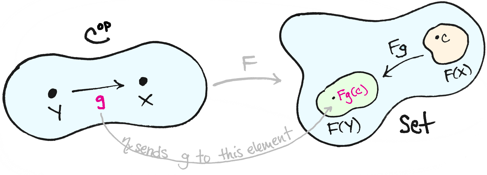

#core/mathematicalphysics #core/artificialintelligence 

The Yoneda lemma is a prominent theorem in category theory that has been proposed as a solution to the problem of qualia, specifically the **question of how we know if the colours we perceive are the same as those perceived by others.** However, the application of the Yoneda lemma to solve this problem is flawed.

One common misunderstanding is the idea that objects in a category are absolute, similar to set theory and that morphisms are secondary. In reality, in category theory, objects are merely labels, and the relevant information lies in the morphisms. Therefore, the Yoneda embedding theorem, which allows us to probe objects with morphisms, does not provide any new information about the objects themselves.

Another fallacy is the assumption that by choosing morphisms to define a category, we can reflect the nature of the objects we started with. However, the choice of morphisms also determines which objects are considered isomorphic, leading to the identification of objects that were initially deemed different.

While the Yoneda lemma may not solve the problem of qualia, there are still interesting ideas to explore. Presheaves over a category can be seen as "observables" and have a rich structure, allowing us to talk about virtual objects that behave like real ones. The mathematical question then becomes how well we can reconstruct a category given its category of presheaves.

> [!note]
> More information:
> - <https://www.youtube.com/watch?v=4GJ4UQZvCNM>
> - <https://matteocapucci.wordpress.com/2023/07/15/no-the-yoneda-lemma-doesnt-solve-the-problem-of-qualia>