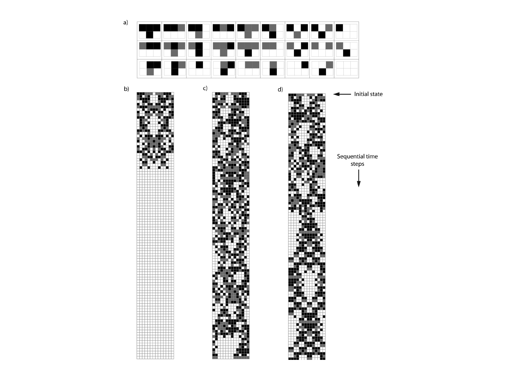

#core/computationalmathematics

Computational irreducibility is the property of **a computational system whose outcome cannot be predicted without performing every intermediate step of its evolution.** Introduced by [Stephen Wolfram](https://en.wikipedia.org/wiki/Stephen_Wolfram) in _A New Kind of Science_ (2002), it formalises the intuition that some processes resist analytical shortcuts — the only way to know what happens is to let them run.

## Principle of Computational Equivalence

Wolfram's **Principle of Computational Equivalence** (PCE) provides the theoretical basis: almost any system whose behaviour is not obviously simple is computationally equivalent — capable of universal computation. Among universal systems, computational irreducibility is the _generic_ case. Reducibility — where a shortcut or closed-form solution exists — is the exception.

This means predictive intractability is not a rare pathology but the default state of complex systems. The halting problem's undecidability is a formal shadow of the same phenomenon: there is no general algorithm for determining whether a program will terminate, because you must often run it to find out.

## Examples

- **Cellular automata** — Wolfram's Rule 30, a simple 1D automaton with 8 possible neighbourhood states, produces patterns so complex that not even Wolfram himself can predict their evolution without step-by-step simulation. The rule fits in one line; its behaviour fills volumes.
- **Weather and climate** — atmospheric dynamics are computationally irreducible. No closed-form equation predicts next week's weather; numerical simulation iterates Navier-Stokes approximations forward in time.
- **Biological evolution** — the trajectory of a population under mutation, selection, and drift cannot be shortcut. You must simulate generations. This is why evolutionary biology remains a historical science.
- **Neural computation** — the brain's activity unfolds irreducibly. Even with perfect connectomic and biophysical models, the only way to know what a [neocortex](../../003_education/_general/neocortex.md) will compute is to simulate it. This places fundamental limits on [brain emulation](../_general/consciousness_engineering.md).

## Implications

Computational irreducibility has consequences across disciplines:

- **Prediction limits** — it establishes a principled bound on foresight. For irreducible systems, observation of the future requires simulation of every intervening state. No theory, however complete, can compress the computation.
- **Occam's razor fails** — [Occam's razor](../_general/occams_razor.md) favours simpler explanations, but computational irreducibility shows that the simplest _program_ can produce arbitrarily complex behaviour. Parsimony in description does not guarantee parsimony in prediction.
- **Weak emergence** — computationally irreducible behaviour is the hallmark of [weak emergence](strong_emergence.md): macro-level patterns that follow from micro-rules but cannot be derived without simulation. See [emergent properties](emergent_properties.md) for the general phenomenon.
- **Consciousness** — [Integrated Information Theory](integrated_information_theory.md) (IIT) defines consciousness as a system's capacity for _irreducible_ cause-effect power (Φ). The irreducibility is computational: the cause-effect structure cannot be decomposed into independent parts. This is not metaphorical — it applies the same formal concept to phenomenology.

## Relation to the Ruliad

The [ruliad](ruliad.md) is the limit object of all possible computational rules and their evolutions — the entangled structure of every computation running simultaneously. Computational irreducibility is the local experience of navigating the ruliad: at any point, the path forward cannot be deduced; it must be traversed. Our physical universe, in Wolfram's framing, is a particular slice of the ruliad, and its irreducibility is why physics requires experiment and simulation, not just theory.

## Related Concepts

- [Ruliad](ruliad.md) — the universal computational structure from which irreducibility emerges
- [Strong emergence](strong_emergence.md) — the philosophical claim that irreducibility may cross the threshold into genuine novelty
- [Emergent properties](emergent_properties.md) — the broader class of macro-level phenomena
- [Occam's razor](../_general/occams_razor.md) — the heuristic computational irreducibility limits
- [Integrated Information Theory](integrated_information_theory.md) — IIT's Φ as a measure of irreducible cause-effect power
- [Shannon information](../books/the_feeling_of_life_itself/shannon_information.md) — the information-theoretic foundation
