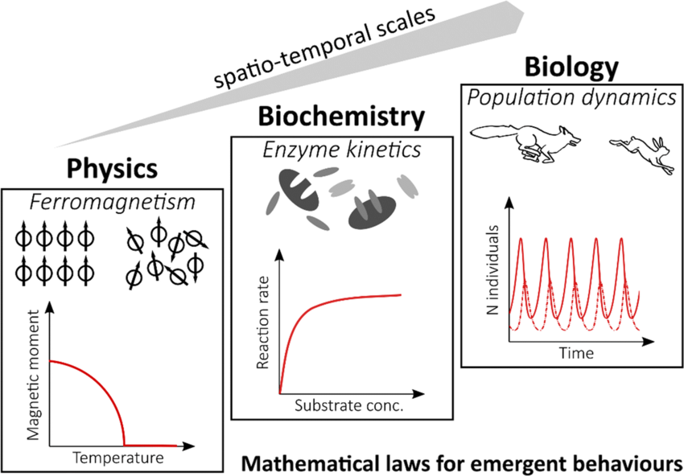

#core/computationalmathematics #core/syntheticphenomenology

**Emergent properties** are characteristics that arise at macroscopic levels and cannot be predicted solely from the properties of microscopic components. They emerge when parts interact in wider wholes. The term embodies the concept "the whole is more than the sum of its parts" and appears across biology, chemistry, physics, and AI. Examples include life from non-living molecules and temperature from particle motion.

See [Strong emergence](strong_emergence.md) for the philosophical distinction between weak and strong forms — the difference is whether higher-level properties are in principle deducible from lower-level dynamics (weak, nomological emergence) or represent fundamentally new causal powers irreducible to the substrate (strong). This distinction has direct consequences for [consciousness engineering](../_general/consciousness_engineering.md) and [multiple realisability](../books/how_to_build_a_brain/multiple_realisability.md).

## Biological Examples

- **[Synaptic plasticity](../../003_education/kings-college/04_biological_foundations_of_mental_health/synaptic_plasticity.md).** LTP and LTD are molecular-level changes (NMDA receptor activation, protein synthesis) yet produce system-level phenomena — learning, memory, and behavioural adaptation — that cannot be reduced to any single synapse.
- **[Hebbian plasticity](../../003_education/kings-college/04_biological_foundations_of_mental_health/hebbian_synaptic_plasticity.md).** "Cells that fire together, wire together" describes a local rule; yet large-scale cortical maps, critical periods, and perceptual organisation emerge from millions of locally Hebbian synapses operating in parallel.
- **Cortical reorganisation.** Following stroke or sensory loss, functional roles migrate to new tissue. The process is emergent: no single neuron "knows" what is lost, but distributed plasticity collectively restores function.
- **[Physical reservoir computing](../social-media/x/physical_reservoir_computing.md).** Complex computation emerges from the intrinsic nonlinear dynamics of a physical substrate — no component is engineered for the task, only the readout is trained.

## Consciousness as Emergent Property

Whether consciousness is weakly or strongly emergent is perhaps the central question of the field:

- **[Integrated information theory](integrated_information_theory.md) (Tononi).** Φ is an emergent measure — irreducible to the sum of parts, but strictly derivable from the causal structure of the physical substrate. IIT thus treats consciousness as weakly emergent: novel at the system level, but no extra physical ingredient required.
- **[Strong emergence](strong_emergence.md).** If consciousness is strongly emergent from specific biological processes (as Searle's biological naturalism or Penrose–Hameroff OrchOR suggest), then it cannot be replicated in a functionally equivalent but physically different system — breaking [multiple realisability](../books/how_to_build_a_brain/multiple_realisability.md).
- **[Hemispherotomy](../books/sizing_up_consciousness/hemispherotomy.md).** The preservation of unified consciousness after ~50% substrate reduction is evidence that phenomenal experience is an emergent property of integration patterns, not of neural mass.

> [!info] Cross-Domain Examples
> 
> - **Key Features:**
>   - Arise from interactions between simpler components
>   - Not reducible to the sum of individual parts
>   - Exhibit unpredictability at higher levels
> - **Examples in Science:**
>   - Consciousness from neural networks
>   - Market trends from individual trading behaviours
>   - Weather systems from atmospheric particles
>   - Phase transitions (water → ice) from molecular interactions
>   - Flocking behaviour from individual movement rules
> - **Why It Matters:**
>   - Challenges reductionist approaches
>   - Essential for understanding complexity in nature and technology
>   - Determines whether engineered consciousness requires the same physical substrate as biological consciousness

## Related Concepts

- [Strong emergence](strong_emergence.md) — weak vs strong taxonomy
- [Multiple realisability](../books/how_to_build_a_brain/multiple_realisability.md) — hinges on emergence type
- [Integrated information theory](integrated_information_theory.md) — Φ as emergent consciousness metric
- [Consciousness engineering](../_general/consciousness_engineering.md) — practical dependence on weak emergence
- [Synaptic plasticity](../../003_education/kings-college/04_biological_foundations_of_mental_health/synaptic_plasticity.md) — learning as emergent property
- [Hemispherotomy](../books/sizing_up_consciousness/hemispherotomy.md) — evidence for emergence from integration
- [Physical reservoir computing](../social-media/x/physical_reservoir_computing.md) — computation from nonlinear emergence
