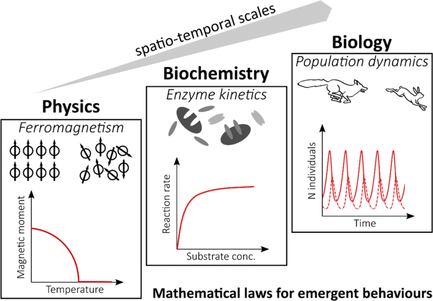

#lead/computationalphilosophy

**Emergent properties** are higher-level characteristics that arise from interactions among components in a wider whole. They can be novel relative to the individual parts without being irreducible in principle. The term embodies the concept "the whole is more than the sum of its parts" and appears across biology, chemistry, physics, and AI. Examples include life from non-living molecules and temperature from particle motion.

See [Strong emergence](strong_emergence.md) for the philosophical distinction between weak and strong forms. That emergence axis is separate from substrate specificity: neither strong emergence nor weak emergence by itself determines which materials or organisations can realise a property. [Multiple realisability](../books/how_to_build_a_brain/multiple_realisability.md) is a distinct and contested claim.

## Biological Examples

- **[Synaptic plasticity](../../003_education/kcl/04_biological_foundations_of_mental_health/synaptic_plasticity.md).** LTP and LTD are molecular-level changes (NMDA receptor activation, protein synthesis) yet produce system-level phenomena — learning, memory, and behavioural adaptation — that cannot be reduced to any single synapse.
- **[Hebbian plasticity](../../003_education/kcl/04_biological_foundations_of_mental_health/hebbian_synaptic_plasticity.md).** "Cells that fire together, wire together" describes a local rule; yet large-scale cortical maps, critical periods, and perceptual organisation emerge from millions of locally Hebbian synapses operating in parallel.
- **Cortical reorganisation.** Following stroke or sensory loss, functional roles migrate to new tissue. The process is emergent: no single neuron "knows" what is lost, but distributed plasticity collectively restores function.
- **[Physical reservoir computing](../social/twitter/physical_reservoir_computing.md).** Complex computation emerges from the intrinsic nonlinear dynamics of a physical substrate — no component is engineered for the task, only the readout is trained.

## Consciousness as Emergent Property

Whether consciousness is emergent, and in what sense, remains contested:

- **[Integrated information theory](integrated_information_theory.md) (Tononi).** IIT defines Φ from a system's causal structure. Whether that makes consciousness weakly emergent, strongly emergent, or neither is an interpretive question; IIT does not settle the taxonomy.
- **[Strong emergence](strong_emergence.md).** A strong-emergence view concerns the derivability and autonomy of a higher-level property. It does not by itself imply that the property requires a biological substrate. That additional claim is separate from [multiple realisability](../books/how_to_build_a_brain/multiple_realisability.md).
- **[Hemispherotomy](../books/sizing_up_consciousness/hemispherotomy.md).** The preservation of reported unified consciousness after major substrate disconnection is compatible with several accounts. It does not by itself establish an emergence type or prove substrate independence.

> [!info] Cross-Domain Examples
> 
> - **Key Features:**
>   - Arise from interactions between simpler components
>   - Not reducible to the sum of individual parts
>   - Exhibit unpredictability at higher levels
> - **Examples in Science:**
>   - Consciousness from neural networks
>   - Market trends from individual trading behaviours
>   - Weather systems from atmospheric particles
>   - Phase transitions (water → ice) from molecular interactions
>   - Flocking behaviour from individual movement rules
> - **Why It Matters:**
>   - Challenges reductionist approaches
>   - Essential for understanding complexity in nature and technology
>   - Keeps emergence type distinct from the question of which physical substrates can realise consciousness

## Related Concepts

- [Strong emergence](strong_emergence.md) — weak vs strong taxonomy and the separate substrate-specificity axis
- [Multiple realisability](../books/how_to_build_a_brain/multiple_realisability.md) — a distinct, contested claim about physical realisers
- [Integrated information theory](integrated_information_theory.md) — Φ as a theoretical IIT quantity/criterion
- [Consciousness engineering](../_general/consciousness_engineering.md) — feasibility depends on whether the relevant organisation and physical substrate can realise the property, not merely on whether it is weakly or strongly emergent
- [Synaptic plasticity](../../003_education/kcl/04_biological_foundations_of_mental_health/synaptic_plasticity.md) — learning as emergent property
- [Hemispherotomy](../books/sizing_up_consciousness/hemispherotomy.md) — clinical observation relevant to substrate dependence, not decisive evidence for emergence type
- [Physical reservoir computing](../social/twitter/physical_reservoir_computing.md) — computation from nonlinear emergence
