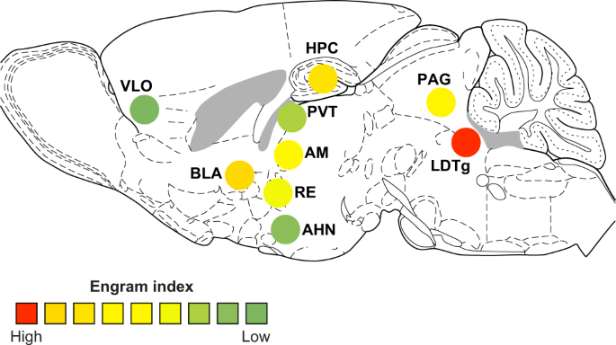

#core/artificialintelligence #core/appliedneuroscience

An [engram](engram.md) complex is the **distributed network of neural connections and activity patterns that collectively encode, store, and retrieve a specific memory.** Unlike early localisation hypotheses, the [engram](engram.md) complex framework holds that memories are not confined to single brain regions but emerge from coordinated activity across multiple structures.

## Lashley's Lesion Studies

Karl Lashley's cortical ablation experiments (1920s–1950s) sought to locate discrete memory traces by systematically lesioning cortical tissue in rats trained on maze tasks. His findings yielded two principles:

- **Equipotentiality**: within a given cortical area, any portion can substitute for any other in supporting a learned behaviour
- **Mass action**: the severity of memory impairment scales with the total volume of cortex removed, not the specific region ablated

These results led Lashley to his famous conclusion that the [engram](engram.md) is "nowhere and everywhere" — memories are not localised but distributed, forming the foundation of the [engram](engram.md) complex concept.

## Distributed Memory Networks

Modern neuroscience has confirmed that memory traces span multiple brain regions simultaneously. The diagram above maps [engram](engram.md) indices across nine regions in the rodent brain:

| Region | Full Name | Role |
|--------|-----------|------|
| HPC | Hippocampus | Contextual and spatial encoding |
| BLA | Basolateral Amygdala | Emotional valence |
| PVT | Paraventricular Thalamus | Arousal and salience gating |
| AM | Anteromedial Thalamus | Spatial memory relay |
| RE | Nucleus Reuniens | Hippocampal–prefrontal coordination |
| VLO | Ventrolateral Orbitofrontal Cortex | Value-based associations |
| PAG | Periaqueductal Grey | Defensive and affective responses |
| AHN | Anterior Hypothalamic Nucleus | Autonomic memory components |
| LDTg | Laterodorsal Tegmental Nucleus | Cholinergic modulation of encoding |

This distribution spans forebrain, thalamus, midbrain, and hindbrain — demonstrating that even a single memory engages a brain-wide ensemble.

## Relationship to Engrams

While an [engram](engram.md) refers to the physical trace of a memory at the cellular level (specific neurons and [synaptic changes](../../003_education/kings-college/04_biological_foundations_of_mental_health/synaptic_plasticity.md)), the [engram](engram.md) complex describes the higher-order organisation of these traces into a distributed ensemble:

- **[Engram](engram.md) cells** are the building blocks; the **[engram](engram.md) complex** is the architecture
- [Ecphory](../../003_education/epfl/01_systems_neuroscience/ecphory.md) — the retrieval process — must reactivate not just local [engram](engram.md) cells but coordinate the entire complex across regions
- [Hebbian assemblies](../../004_subsidiary/_general/hebbian_assemblies.md) provide the wiring rule; the [engram](engram.md) complex is the resulting multi-regional circuit

## Computational Parallels

The distributed nature of [engram](engram.md) complexes finds direct analogues in artificial intelligence:

- **Distributed representations** in neural networks — no single unit encodes a concept; activation patterns across many units do
- **Content-addressable memory** — retrieval via partial cues mirrors how [ecphory](../../003_education/epfl/01_systems_neuroscience/ecphory.md) can reactivate an entire complex from a fragment
- **Holographic models** (Gabor, 1968; Pribram, 1971) — interference patterns distribute information across the entire storage medium, such that any part contains a degraded version of the whole

## Implications for Consciousness Engineering

If memories are fundamentally distributed across brain-wide networks, then any approach to [consciousness engineering](../_general/consciousness_engineering.md) must preserve not just individual neurons but the **network topology** that constitutes the [engram](engram.md) complex. This poses a core constraint for substrate transfer: fidelity requires capturing distributed patterns and their inter-regional dynamics, not merely local structure.
