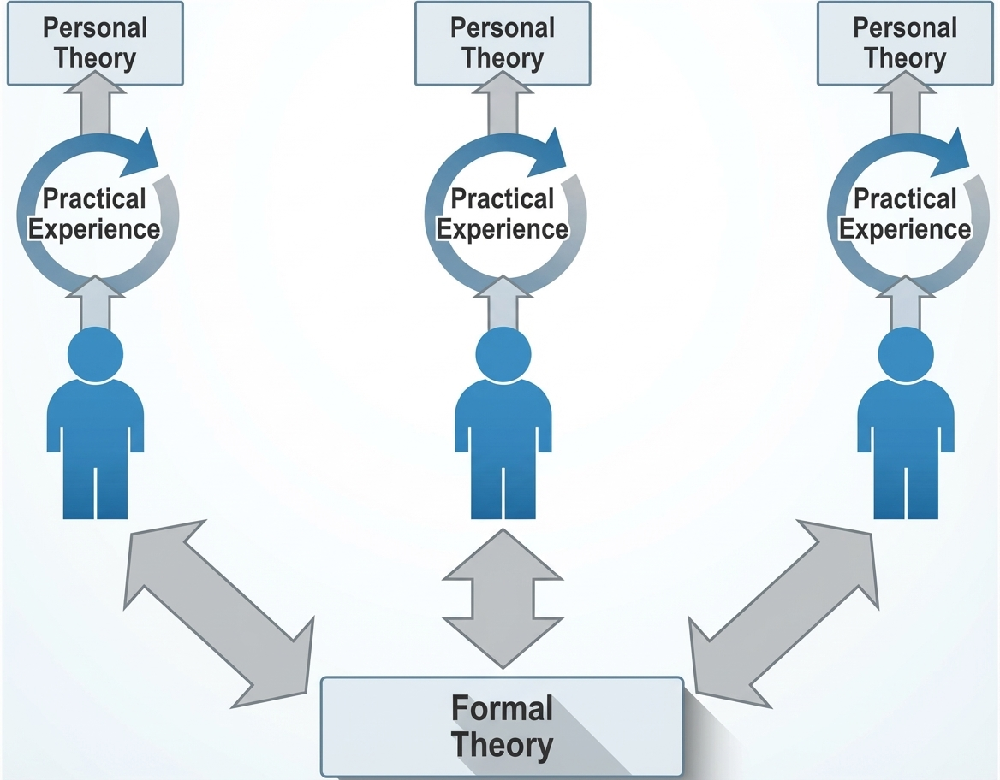

#core/computationalmathematics #fundamental/logic

A formal theory is a **symbolic system consisting of a set of axioms and rules of inference for deriving theorems from those axioms using formal logic**. The axioms are the starting assumptions, taken as primitive within the system; the theorems are additional statements provable from them. A formal theory strips meaning away — it operates on syntax alone, making it amenable to mechanical verification and, in principle, automation.

## Mathematical Formal Theories

| Theory | Domain | Notable Properties |
|---|---|---|
| **Zermelo–Fraenkel set theory (ZFC)** | Sets, membership | Foundation of nearly all modern mathematics; consistency cannot be proven within ZFC itself |
| **Peano arithmetic** | Natural numbers, induction | Incomplete per Gödel; there exist true arithmetic statements unprovable within the system |
| **Theory of real closed fields** | Real numbers, polynomials | Complete and decidable — a rarity among expressive formal theories (Tarski, 1951) |

## Computer Science

Formal theories underpin the theoretical foundations of computation:

- **Formal language theory** — defines languages using precise grammars and studies abstract machines (finite automata, pushdown automata, Turing machines) that recognise or generate them
- **Programming language semantics** — operational, denotational, and axiomatic semantics give languages formal syntax and meaning, enabling compiler verification and type safety proofs
- **Computability theory** — asks what is computable in principle, classifying problems by their position in the arithmetic and analytic hierarchies
- **Complexity theory** — studies the resources (time, space, randomness) needed to solve computational problems; formalised via Turing machine models

## In Physics

Physical theories are formal theories instantiated in the material world:

- **Classical mechanics** — Lagrangian and Hamiltonian formulations are formal systems operating on configuration spaces and phase spaces, with the principle of least action as their core axiom
- **Quantum field theory** — the Standard Model is a formal theory (a gauge theory with symmetry group $SU(3) \times SU(2) \times U(1)$) whose empirical adequacy is extraordinary but whose mathematical foundations remain unsettled
- **Statistical mechanics** — bridges microscopic and macroscopic descriptions; the [coarse-graining](../papers/coarse_graining.md) operation that defines thermodynamic observables can itself be formulated as a formal mapping between theories at different scales

## Gödel's Incompleteness and Its Reach

> [!important] Gödel's Incompleteness Theorems (1931)
> Any consistent formal theory capable of expressing basic arithmetic is incomplete — there exist true statements unverifiable within the system. Moreover, such a theory cannot prove its own consistency. These results reveal inherent limits to what formal systems can achieve.

Gödel's limit extends beyond mathematics. [Computational irreducibility](computational_irreducibility.md) is the dynamical counterpart: just as some truths evade formal proof, some system trajectories resist shortcuts — they must be simulated step by step. Where Gödel showed that _knowing_ has limits, irreducibility shows that _predicting_ does.

[Integrated information theory](integrated_information_theory.md) (IIT) is itself a formal theory — it takes phenomenological axioms (experience exists, is structured, specific, unified, definite) and derives postulates about the physical substrate of consciousness, yielding a computable measure $\Phi$. Whether its axioms capture what they claim is a separate question — but IIT is a formal theory in the strict sense: a symbolic system with axioms and rules for deriving theorems.

## Formal Theories and the Vault

Formal theories are not merely descriptive — they are _generative_. A well-chosen axiom system does not just catalogue known facts; it produces new ones:

- **[Occam's razor](../_general/occams_razor.md)** — in axiom selection, parsimony is the tiebreaker: prefer the theory with fewer primitives for equal explanatory power
- **[Strong emergence](strong_emergence.md)** — if strong emergence is genuine, some phenomena cannot be captured by _any_ finite formal theory of their components, no matter how elaborate
- **[Invariant brain emulation](../../002_profession/eightsix-science/invariant_brain_emulation.md)** — the invariance criterion $O(f(b)) \equiv O(b)$ is a formal statement about when two substrates are observationally equivalent, making brain emulation a formal theory of substrate identity

## Related Concepts

- [Integrated information theory](integrated_information_theory.md) — a formal theory of consciousness with phenomenological axioms
- [Computational irreducibility](computational_irreducibility.md) — Gödel's dynamical counterpart: some systems resist shortcuts
- [Strong emergence](strong_emergence.md) — the claim that some phenomena defy formal reduction
- [Occam's razor](../_general/occams_razor.md) — the parsimony principle for axiom selection
- [Coarse-graining](../papers/coarse_graining.md) — formal mapping between theories at different scales
- [Invariant brain emulation](../../002_profession/eightsix-science/invariant_brain_emulation.md) — formal equivalence between neural substrates
