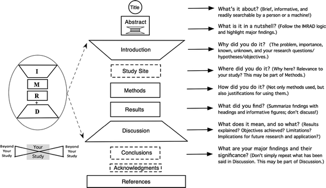

#fundamental/communication

**IMRaD** (Title, Abstract, **I**ntroduction, **M**ethods, **R**esults **and D**iscussion) is the **canonical structural format for empirical research papers**. It maps the epistemic arc of a study onto its prose: motivation, how it was done, what was found, and what it means. It is the primary approach in psychology, many journals provide guides for titles and subtitles, and it reflects the process of conducting [positive science](../articles/positive_science_vs_non-positive_science.md).

## Sections

- **Title & Abstract**: compressed announcement of the finding; the part most people read
- **Introduction**: what question, and why it matters
- **Methods**: how the question was operationalised — detailed enough for replication
- **Results**: what the data showed, without interpretation
- **Discussion**: what the findings mean, their limitations, and open questions

## Related

- [positive_science_vs_non-positive_science](../articles/positive_science_vs_non-positive_science.md) — the epistemic stance IMRaD encodes: description before interpretation
- [heterophenomenology](../podcasts/heterophenomenology.md) — Dennett's scientific method for reports of experience; produces the data such papers then structure
