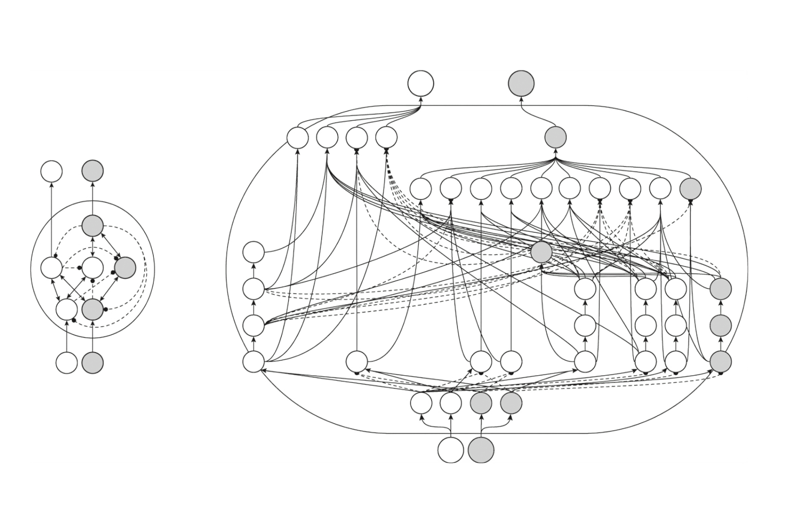

#core/artificialintelligence #core/syntheticphenomenology

**Integrated Information Theory (IIT)** proposes that consciousness *is* a system's capacity for irreducible cause-effect power — the degree to which a system specifies information about its own past and future states that cannot be decomposed into independent parts. Developed by psychiatrist and neuroscientist [Giulio Tononi](https://www.linkedin.com/in/giulio-tononi-1032b538), IIT is unusual among consciousness theories in starting from [phenomenology](../../003_education/kings-college/03_mental_health_in_the_community/phenomenology.md) (what experience *is like*) and deriving mathematical constraints, rather than starting from neural mechanisms and asking when they produce experience.

## Phenomenological Axioms

IIT begins with five essential properties of every conscious experience, treating them as axioms any theory of consciousness must satisfy:

1. **Intrinsicality** — experience exists *for itself*, intrinsic to the experiencing subject, not dependent on an external observer. IIT terms this *intrinsic existence*.
2. **Composition** — experience is structured; it has phenomenal distinctions (colours, shapes, emotions) that compose the whole. These are *phenomenal distinctions*.
3. **Information** — each experience is specific; it rules out alternative possible experiences. The system specifies a *cause-effect structure* that differs from chance.
4. **Integration** — experience is unified; it cannot be decomposed into independent phenomenal components. The cause-effect structure must be *irreducible*.
5. **Exclusion** — experience is definite; it has a specific spatiotemporal grain. The cause-effect structure with maximal Φ defines the *main complex* of consciousness.

These axioms form the bridge between phenomenological description and information-theoretic formalism — they translate first-person properties of experience into mathematical constraints. See [naturalisation of phenomenology](../articles/naturalisation_of_phenomenology.md) for the broader bridging programme.

## Φ (Phi) — Integrated Information

- **Definition**: Φ quantifies the degree to which a system's cause-effect structure is irreducible — how much information the whole generates beyond the sum of its parts' independent information.
- **Calculation**: Computing Φ is computationally intractable for realistic neural systems (NP-hard in general). Practical approximations exist (pyphi toolbox, MICS algorithm) but full Φ for a human brain remains out of reach.
- **Interpretation**: Φ = 0 for purely feedforward systems and systems decomposable into independent parts. Φ > 0 indicates genuine causal integration. Φ reaches its maximum for the system's *main complex* — the constellation of elements that together specify the maximally irreducible cause-effect structure.
- **Substrate independence**: Φ is defined over causal structure — a system's mechanisms, their possible states, and the transition probabilities between them — not over a specific physical substrate. Any physical system realising the right cause-effect structure with non-zero Φ is, according to IIT, conscious. This makes Φ a candidate **substrate-independent consciousness metric**, central to verification in [PSNST](../_general/psnst.md).

## Cause-Effect Structure and Intrinsic Causality

The central mathematical object in IIT is the **cause-effect structure** — a Φ-folded constellation of concepts in cause-effect space:

- Each mechanism within a system specifies a *cause repertoire* (what states could have caused its current state) and an *effect repertoire* (what states it can cause).
- A *concept* is the maximally irreducible cause-effect repertoire of a mechanism — a point in cause-effect space.
- The full cause-effect structure is the set of all concepts across the system, and is claimed to be **identical** to the quality of the experience (not merely correlated with it — this is IIT's strong identity claim).

This notion of **intrinsic causal structure** underlies IIT's critique of purely functional approaches: two systems with identical input-output mappings but different internal causal architectures may have different Φ values — and therefore, per IIT, different conscious experiences. This is directly relevant to the comparison between [Moravec transfer](../social-media/x/moravec_transfer.md) (which out-sources computation to a digital simulation, potentially stripping intrinsic causality) and [ECP/PSNST](../_general/psnst.md) (which preserves intrinsic causal structure in the replacement substrate). The mathematical contract for substrate equivalence is formalised in [invariant brain emulation](../../002_profession/eightsix-science/invariant_brain_emulation.md).

## IIT 4.0 (2019–Present)

The current formulation introduced several refinements over earlier versions:

- **System-intrinsic partition**: Earlier versions used a minimum information partition; 4.0 uses a partition based on *difference-making* rather than information-theoretic minimum.
- **Refined exclusion**: The main complex is identified via a maximal-Φ criterion that better handles nested systems.
- **Feedforward exclusion**: Pure feedforward architectures (e.g., standard deep neural networks) are assigned Φ = 0 regardless of their functional capabilities, because they lack recurrent causal structure.

## Emergence Status

Whether IIT's Φ is best understood as a case of [weak or strong emergence](strong_emergence.md) is actively debated:

- **Weak-emergence reading**: Φ is formally derivable from a system's transition probability matrix — given the right computation, it follows from the micro-level. Consciousness is a property of the *organisation* of matter, not of matter *per se*.
- **Strong-emergence reading**: The cause-effect structure has genuinely novel intrinsic existence — it is not merely a formal description but an additional ontological fact. Tononi's language of "intrinsic existence" is sometimes read as entailing strong emergence.

This classification carries direct stakes for [consciousness engineering](../_general/consciousness_engineering.md): if Φ is weakly emergent, reproducing the causal architecture in [biomimetic neuromorphic](../../002_profession/eightsix-science/biomimetic_neuromorphics.md) substrates should preserve consciousness. If it is strongly emergent, the specific material realisation may matter beyond the causal pattern — a far more demanding constraint.

## Empirical Tests

### Perturbational Complexity Index (PCI)

The "zap-and-zip" method (Casali et al., 2013 *Science Translational Medicine*) operationalises the integration-differentiation requirement without computing Φ directly. A TMS pulse to cortex is followed by high-density EEG; the Lempel-Ziv algorithmic complexity of the binarised spatiotemporal response reliably distinguishes conscious from unconscious states (PCI ≥ 0.31 threshold), including detection of covert consciousness in behaviourally unresponsive patients.

**Limitations**: PCI lacks a formal derivation from IIT axioms and may measure complexity without specifically measuring integration (Virmani & Nagaraj, 2019). See [quantitative consciousness index](../papers/quantitative_consciousness_index.md).

### COGITATE Consortium (2025)

The adversarial collaboration published in *Nature* (April 2025) tested IIT vs GNWT predictions in 256 participants. IIT's prediction that posterior-cortex synchronisation specifies consciousness was challenged: sustained synchrony was observed in frontal regions, not posterior cortex. However, GNWT also failed to account for key findings. See [neural correlate of consciousness](../books/the_feeling_of_life_itself/neural_correlate_of_consciousness.md) for the full results.

### Hemispherotomy

[Patients surviving hemispherotomy](../books/sizing_up_consciousness/hemispherotomy.md) retain consciousness — a finding IIT accommodates because Φ depends on integrated information within the *remaining* tissue, not on total brain volume. The remaining hemisphere's recurrent cortical architecture is sufficient to sustain a main complex with non-zero Φ.

## Criticisms

- **Untestability**: Φ cannot currently be computed for real brains; the theory's predictions for large neural systems remain untestable in practice. The COGITATE (2025) results challenged IIT's specific posterior-cortex prediction.
- **Panpsychism implication**: IIT implies any system with non-zero Φ is conscious, including simple logic gates (Φ ≈ 0.00001). Critics consider this a *reductio ad absurdum*.
- **Exclusion boundary problem**: IIT must select a spatiotemporal scale for the main complex, but why neuronal firing patterns rather than molecular dynamics or field potentials? The choice of neuronal grain appears theory-driven.
- **Missing content sensitivity**: Φ cannot distinguish between phenomenologically different experiences with equal Φ values — it may capture *level* of consciousness but not *content*.
- **Causal exclusion**: How IIT's intrinsic causal powers relate to [Kim's causal exclusion argument](strong_emergence.md) against downward causation remains contested.

## Relation to Consciousness Engineering

IIT occupies a strategic position in [consciousness engineering](../_general/consciousness_engineering.md):

- **Substrate independence**: IIT provides the most developed mathematical argument that consciousness depends on causal architecture rather than biological substrate — directly supporting the feasibility of synthetic neural substrates for [PSNST](../_general/psnst.md).
- **Verification**: If Φ can be estimated during progressive transfer, it offers an objective, continuous measure of consciousness preservation that does not require behavioural report.
- **Risk**: If IIT is correct that every causal mechanism contributes to experience, gradual substrate replacement must preserve not just global Φ but the specific cause-effect structure — a far more demanding constraint than preserving input-output function alone. The [Moravec transfer](../social-media/x/moravec_transfer.md), which outsources computation, may fail on these grounds.

## Related Concepts

- [Shannon information](../books/the_feeling_of_life_itself/shannon_information.md) — classical information theory; IIT extends beyond Shannon
- [Neural correlate of consciousness](../books/the_feeling_of_life_itself/neural_correlate_of_consciousness.md) — empirical search programme; IIT provides one theoretical framework
- [Higher-order theories of consciousness](../books/sizing_up_consciousness/higher-order_theories_of_consciousness.md) — competing theory; see comparison
- [Access and phenomenal consciousness](access_and_phenomenal_consciousness.md) — IIT targets phenomenal, not access consciousness
- [Strong emergence](strong_emergence.md) — whether Φ is weakly or strongly emergent is debated
- [Phenomenology](../../003_education/kings-college/03_mental_health_in_the_community/phenomenology.md) — IIT's axiomatic method is explicitly phenomenological
- [Naturalisation of phenomenology](../articles/naturalisation_of_phenomenology.md) — IIT as a mathematical bridge between first- and third-person methods
- [Philosophical zombies](../_general/philosophical_zombies.md) — IIT denies zombies are possible: any system with the right Φ is conscious
- [PSNST](../_general/psnst.md) — substrate verification via Φ monitoring during progressive transfer
- [Moravec transfer](../social-media/x/moravec_transfer.md) — digitisation approaches risk losing intrinsic causal structure (Φ → 0)
