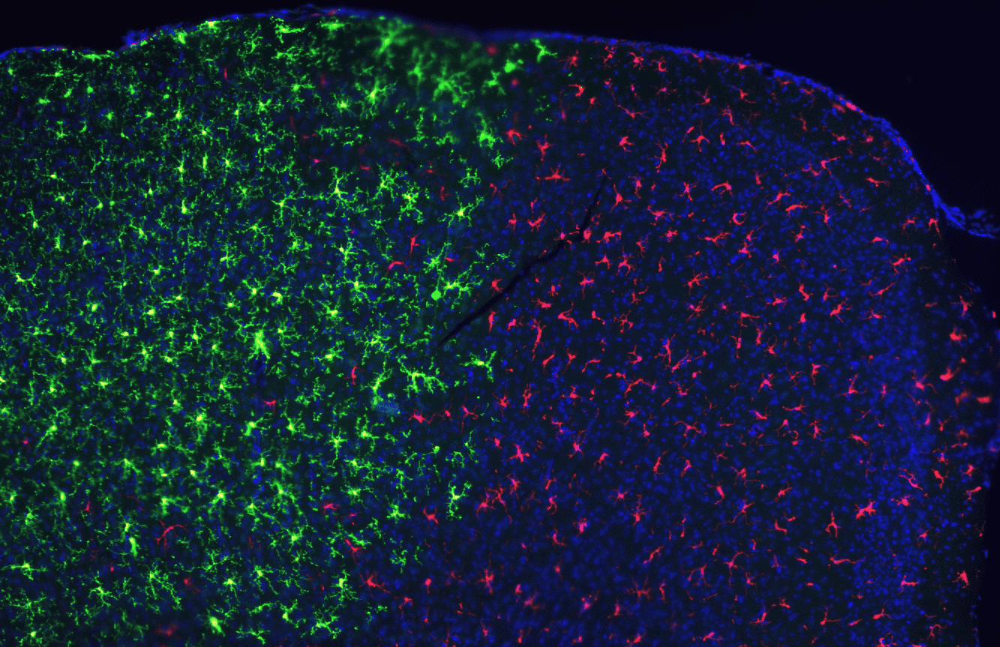

#core/appliedneuroscience #core/theoreticalneurosurgery #core/biomimeticneuromorphics

Neural grafts (also termed _neural tissue transplantation_ or _neural implants_) are the **surgical introduction of neural cells or tissue into the brain or spinal cord** to replace, repair, or augment compromised circuits. They sit at the intersection of [personalised regenerative medicine](../_general/personalised_regenerative_medicine.md), [biomimetic neuromorphics](../../002_profession/eightsix-science/biomimetic_neuromorphics.md), and theoretical neurosurgery — the canonical intervention class through which synthetic neural substrates enter the living brain.

## Cell Sources

| Source                                       | Properties                                                                                                                                  | Constraints                                                                                                                                                                  |
| -------------------------------------------- | ------------------------------------------------------------------------------------------------------------------------------------------- | ---------------------------------------------------------------------------------------------------------------------------------------------------------------------------- |
| **Foetal/embryonic neural tissue**           | Authentic developmental trajectory; yields neurons, astrocytes, oligodendrocytes                                                            | Limited supply; ethical restrictions; donor variability                                                                                                                      |
| **Embryonic stem cells (ESCs)**              | Pluripotent; full lineage potential                                                                                                         | Allogeneic — requires immunosuppression; ethical concerns                                                                                                                    |
| **Induced pluripotent stem cells (iPSCs)**   | Patient-derived (autologous); avoids rejection                                                                                              | [Genetic instability](../../002_profession/eightsix-science/genetic_instability_in_ipscs.md); risk of [anaplastic transformation](../../002_profession/eightsix-science/anaplastic_transformation.md) |
| **Adult neural stem cells**                  | Endogenous niches (subventricular zone, hippocampal dentate gyrus); minimal ethical burden                                                  | Limited expansion capacity; restricted lineage                                                                                                                               |
| **Cortical organoids**                       | 3D self-organised tissue preserving cytoarchitecture; basis for [chimeroid](../courses/_general/chimeroids.md) constructs of multi-donor origin | Immature; vascularisation deficit; ~10⁶ neurons per construct                                                                                                                |
| **Xenogeneic tissue**                        | Effectively unlimited supply via [xenotransplantation](../../002_profession/eightsix-science/xenotransplant.md) of gene-edited animal donors | Hyperacute rejection; zoonotic transmission risk                                                                                                                             |

See [organoid types](../../002_profession/eightsix-science/organoid_types.md) for the broader classification of in-vitro neural tissue substrates.

## Therapeutic Targets

- **Parkinson's disease** — dopaminergic neuron grafts to the putamen (Bjorklund/Lindvall foetal trials in the 1980s–90s; modern hPSC-derived programmes including the Kyoto iPSC trial and BlueRock's bemdaneprocel)
- **Huntington's disease** — striatal medium spiny neuron replacement
- **Stroke and traumatic brain injury** — neural progenitor delivery to peri-infarct cortex
- **Spinal cord injury** — neural and glial precursor grafts bridging lesions
- **Amyotrophic lateral sclerosis (ALS)** — supporting astrocyte and motor-neuron transplants
- **Multiple sclerosis** — oligodendrocyte progenitor remyelination

## Graft–Host Integration

Successful grafting depends on the transplanted tissue establishing a functional continuum with surviving host circuitry. Key biological requirements:

- **Vascularisation** — perfusion via host capillaries; see [cortex vascularisation](../../002_profession/eightsix-science/cortex_vascularisation.md). Avascular grafts develop necrotic cores beyond ~200 μm.
- **Axonal pathfinding** — graft-derived axons must navigate the host parenchyma, guided by molecular gradients and engineered [topographic guidance cues](../../002_profession/eightsix-science/topographic_guidance_cues.md).
- **[Synaptogenesis](../../003_education/kings-college/04_biological_foundations_of_mental_health/synaptogenesis.md)** — formation of pre- and post-synaptic specialisations across the graft–host boundary.
- **Trophic support** — sustained delivery of [neurotrophic factors](../../002_profession/eightsix-science/neurotrophic_factors.md) (BDNF, GDNF, NGF) supports survival and integration; commonly engineered via biomaterial-based controlled release.
- **[Neurogenesis](../../003_education/kings-college/04_biological_foundations_of_mental_health/neurogenesis.md) coupling** — host endogenous neurogenic niches may be recruited or suppressed by the graft microenvironment.

The image above shows the cellular interface in fluorescence microscopy: graft-derived (green) and host (red) neural populations intermingling along a clear boundary, with a visible needle track from stereotaxic delivery and DAPI-stained nuclei (blue) framing the surrounding tissue architecture.

## Delivery and Surgical Considerations

Grafts are typically delivered via [stereotaxic neurosurgery](../../002_profession/eightsix-science/stereotaxic_neurosurgery.md) using MRI/CT-guided coordinates with 1–2 mm accuracy. Delivery vehicles range from cell suspensions through hydrogels (GelMA, fibrin) to pre-formed scaffolds produced by [bioprinting](../../003_education/kings-college/05_neuroscience_in_society/bioprinting.md) or [4D bioprinting](../../002_profession/eightsix-science/4d_bioprinting.md). Brain shift, haemorrhage, and target migration are the principal procedural risks.

## Immunology

The brain is _immune-privileged but not immune-isolated_. Allogeneic grafts (ESC- or unmatched-iPSC-derived) typically require:

- HLA matching where feasible
- Immunosuppression regimens (calcineurin inhibitors, often tapered post-engraftment)
- Microglial activation monitoring

Autologous iPSC grafts circumvent rejection but introduce a manufacturing time burden of months and amplify [genetic instability](../../002_profession/eightsix-science/genetic_instability_in_ipscs.md) risk through extended in-vitro culture.

## Safety and Translation

Neural grafts must navigate a rigorous regulatory pipeline. Principal safety domains:

- **Tumourigenicity** — residual undifferentiated pluripotent cells can form teratomas; mature grafts may undergo [anaplastic transformation](../../002_profession/eightsix-science/anaplastic_transformation.md)
- **Genetic stability** — chromosomal aberrations and copy-number variations accumulated during reprogramming and culture
- **Manufacturing reproducibility** — addressed through GMP standards (see [GMP production](../../002_profession/eightsix-science/gmp_production.md))
- **Clinical evaluation** — the [IDEAL framework](../../002_profession/eightsix-science/ideal_framework.md) provides a five-stage pathway from first-in-human to long-term surveillance

## Within Consciousness Engineering

Neural grafts are the operative substrate of [PSNST](../_general/psnst.md) — Progressive Synthetic Neural Substrate Transfer — where the graft is not a repair but a _replacement layer_: synthetic neural tissue laid sequentially atop biological cortex, with controlled biological cell death prompting neuroplastic migration of encoded information into the synthetic substrate. The [invariant brain emulation](../../002_profession/eightsix-science/invariant_brain_emulation.md) criterion ($O(f(b)) \equiv O(b)$) defines the equivalence the graft must preserve.

This re-frames neural grafting from a _therapeutic_ discipline into a _cognitive preservation_ one — the engineering substrate of extracorporeal cognitive preservation and the consummating intervention of [biomimetic neuromorphics](../../002_profession/eightsix-science/biomimetic_neuromorphics.md).

## Related Concepts

- [PSNST](../_general/psnst.md) — gradual synthetic-substrate transfer using neural grafts as its operative mechanism
- [Biomimetic neuromorphics](../../002_profession/eightsix-science/biomimetic_neuromorphics.md) — engineering discipline producing graft-compatible synthetic substrates
- [Stereotaxic neurosurgery](../../002_profession/eightsix-science/stereotaxic_neurosurgery.md) — precision delivery methodology
- [Organoid types](../../002_profession/eightsix-science/organoid_types.md) and [chimeroids](../courses/_general/chimeroids.md) — cellular building blocks
- [Xenotransplantation](../../002_profession/eightsix-science/xenotransplant.md) — cross-species variant of grafting
- [IDEAL framework](../../002_profession/eightsix-science/ideal_framework.md) — clinical translation pathway
- [Personalised regenerative medicine](../_general/personalised_regenerative_medicine.md) — the broader medical paradigm
