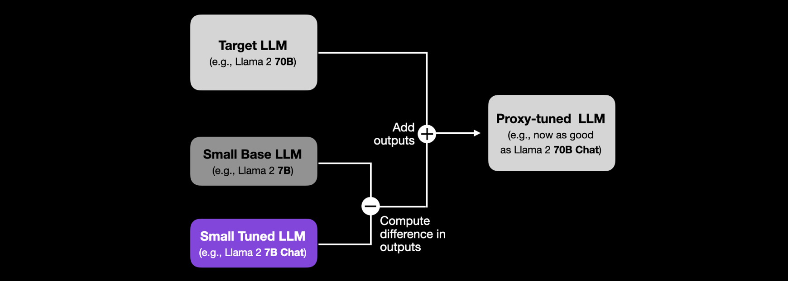

#core/artificialintelligence

Proxy-tuning is a technique for **fine-tuning large language models (LLMs) at the decoding stage without modifying the model's internal weights.** It shifts the logits (the raw output values from the model's final layer) of a large target LLM by adding the logit difference between a small fine-tuned model and its untuned base version — transferring the benefits of fine-tuning from a small, cheap model to a large, expensive one.

## How It Works

1. **Fine-tune a small model** — train a compact base model (e.g., Llama 2 7B) on the target task, producing a tuned variant (e.g., Llama 2 7B Chat).
2. **Compute the logit difference** — at each decoding step, subtract the small base model's logits from the small tuned model's logits. This difference captures *what fine-tuning changed* in the output distribution.
3. **Shift the target's logits** — add that difference to the large target model's logits (e.g., Llama 2 70B) before [softmax](../books/neural_networks_from_scratch/softmax.md) converts them into token probabilities, nudging the large model's generations towards the tuned behaviour.

The result is a proxy-tuned 70B model approaching the quality of a directly fine-tuned 70B Chat model — without ever training the 70B weights.

## When It Helps

- **Closed-weight models** — the target's weights are inaccessible, so direct fine-tuning is impossible.
- **Resource constraints** — full fine-tuning of the large model is too expensive; only the small proxy needs training.
- **Modular adaptation** — one tuned small model can steer many large base models, and updating the adaptation requires retraining only the small proxy.

## Limitations

- **Shared vocabulary required** — the small and large models must share a tokenizer for logits to be comparable token-by-token (e.g., within the Llama 2 family).
- **Assumes scale decoupling** — proxy-tuning presumes that what fine-tuning teaches a small model transfers across scales; this is a [decoupling of scale](decoupling_of_scale.md) assumption that can break down when the large model exhibits capabilities absent in the small proxy.
- **Inference overhead** — decoding requires three forward passes per step (target, small base, small tuned), trading training cost for inference cost.

## Related Concepts

- [Softmax](../books/neural_networks_from_scratch/softmax.md) — the function that turns adjusted logits into token probabilities
- [Decoupling of Scale](decoupling_of_scale.md) — the cross-scale transfer assumption underlying proxy-tuning
