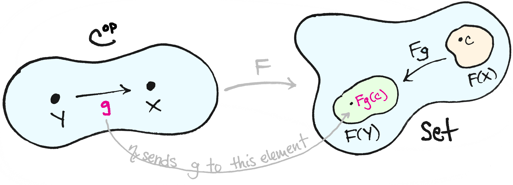

#lead/computationalphilosophy #core/mathematicalphysics

The **Yoneda lemma** says that, in a locally small category $\mathcal{C}$, an object $X$ is determined up to isomorphism by the functor $\mathrm{Hom}(-,X)$: the web of morphisms into $X$. It has been offered as a solution to the **inverted spectrum problem** — whether two observers could have systematically different colour experiences while remaining behaviourally indistinguishable. The application does not work. Yoneda recovers only the relational data already built into the category; it cannot extract phenomenal character from relations that do not encode it.

## The inverted spectrum

The inverted spectrum is a thought experiment about [phenomenal consciousness](access_and_phenomenal_consciousness.md): your red might be my green, with no difference in sorting, naming, or behaviour. If that is possible, then colour experience is not fixed by its functional or relational role. The problem is therefore a test of whether a purely structural description of perception captures what seeing is like, or only how colours stand to one another.

## What Yoneda actually says

Informally: an object is what it is by how it maps to and from other objects. Formally, the Yoneda embedding $y \colon \mathcal{C} \to \mathbf{Psh}(\mathcal{C})$ is fully faithful. Natural transformations $\mathrm{Hom}(-,X) \Rightarrow F$ correspond to elements of $F(X)$. The figure above is this correspondence: a morphism $g \colon Y \to X$ is sent to $Fg(c) \in F(Y)$.

That is a theorem about a category already given. It is not a method for discovering hidden intrinsic properties of the labels we called objects.

## The proposed solution

In category-theoretic consciousness science (notably [Tsuchiya and Saigo, 2021](https://doi.org/10.1093/nc/niab034), and [this talk](https://www.youtube.com/watch?v=4GJ4UQZvCNM)), colours or qualia are taken as objects, and “relationships” among them as morphisms. Yoneda is then invoked to conclude that each quale is uniquely pinned down by its unique pattern of relations — unique relationships, unique isomorphism class.

## Why this fails

[Matteo Capucci](https://matteocapucci.eu/no-the-yoneda-lemma-doesnt-solve-the-problem-of-qualia/)’s objection is that the argument treats objects as if they were absolute, as in set theory, and morphisms as an afterthought. In a category the reverse is true: objects are labels, and the data are the morphisms.

- **Circularity.** Once $\mathcal{C}$ is assembled, Yoneda cannot tell you more about its objects than the morphisms already do. Distinguishing qualia by representable presheaves works only if the morphisms were already distinguishing them.
- **Choice of morphisms is a choice of identity.** Adding morphisms to a set of objects yields a setoid $(S, \cong)$, which need not match $(S, =)$. Metric spaces with continuous maps versus short maps have the same objects but different isomorphisms: two metrics that induce the same topology are isomorphic in the first category and not necessarily in the second. Probing with all continuous maps will not recover “the same metric.”
- **Wrong structure, even if well specified.** Starting from a physically determined colour gamut makes the category objective — and thereby changes the subject. Presheaves over that category recover the physical relations put in, not the phenomenal qualities the inverted spectrum asks about.
- **Garbage in, garbage out.** An underspecified “category of qualia” cannot be rescued by a theorem. Mathematical consequences are only as sharp as the definitions.

This is the same structural cheapness as the [Newman problem of the brain](../papers/newman_problem_of_the_brain.md): a purely relational description is too permissive to fix intrinsic character. It is also why inverted spectra remain a challenge to thin [functionalism](../_general/functionalism.md). A morphism-web of colour relations is a functional or structural role; the question was whether that role exhausts the experience.

## What remains interesting

Presheaves can be read as observables, analogous to replacing a system with an algebra of measurements. The useful direction is then reconstruction, not revelation:

1. When is a category of observations $\mathcal{O}$ equivalent to $\mathbf{Psh}(\mathcal{C})$ for some category $\mathcal{C}$ of “things”? (Answered in generality by Bunge, 1969.)
2. If $\mathbf{Psh}(\mathcal{C}) \simeq \mathbf{Psh}(\mathcal{C}')$, must $\mathcal{C} \simeq \mathcal{C}'$? No: this is **Morita equivalence**, coarser than isomorphism. Categories with the same Cauchy completion (Karoubi envelope) share a presheaf category.

Even total observational structure does not uniquely recover the base. Actual science has only finitely many measurements, so one never has $\mathbf{Psh}(\mathcal{C})$ in full. Yoneda therefore cannot close the inverted spectrum, but it does pose a cleaner question: how much of a quality space is fixed by the observations we can actually make, and how much remains unidentified under Morita equivalence?

## Connections

- [Newman problem of the brain](../papers/newman_problem_of_the_brain.md) — structural descriptions that fail to constrain intrinsic properties
- [Access and phenomenal consciousness](access_and_phenomenal_consciousness.md) — relational access versus qualitative character
- [Functionalism](../_general/functionalism.md) — role-based individuation, which inverted spectra are meant to underdetermine
- [Phenomenology](../../003_education/kcl/03_mental_health_in_the_community/phenomenology.md) — first-person structure the relational category does not automatically capture
- [Supervenience](../books/taxonomy_and_metaphysics_of_mind-uploading/supervenience.md) — dependence of experience on a base without identity with that base

## Sources

- [Matteo Capucci, “No, the Yoneda lemma doesn’t solve the problem of qualia”](https://matteocapucci.eu/no-the-yoneda-lemma-doesnt-solve-the-problem-of-qualia/)
- [Tsuchiya and Saigo, “A relational approach to consciousness”](https://doi.org/10.1093/nc/niab034) — *Neuroscience of Consciousness*, 2021
- [Talk proposing Yoneda as a solution](https://www.youtube.com/watch?v=4GJ4UQZvCNM)
- [nLab: Yoneda lemma](https://ncatlab.org/nlab/show/Yoneda+lemma)
