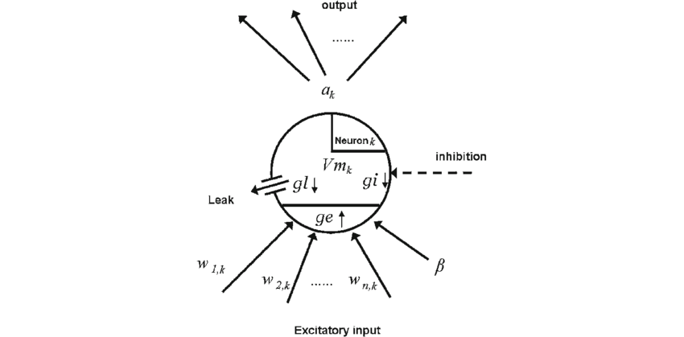

#core/artificialintelligence

A point neuron is a **simplified mathematical model that reduces a neuron's complex spatial structure to a single compartment**, representing the membrane potential as a dimensionless point. This abstraction ignores dendritic morphology and treats all synaptic inputs as arriving at the same location.

## Why Use Point Neurons?

- **Computational efficiency**: Enables simulation of large-scale networks (millions of neurons)
- **Mathematical tractability**: Easier to analyse dynamics and stability
- **Sufficient for many questions**: Captures essential input-output relationships

> [!note] Trade-off
> Point neurons sacrifice biophysical realism (dendritic computation, spatial integration) for scalability. For questions about dendritic processing, multi-compartment models are required.

## Common Point Neuron Models

### Integrate-and-Fire (IF)

- Simplest model: integrates input until threshold, then fires and resets
- No spike shape modelling
- Equation: $\tau_m \frac{dV}{dt} = -(V - V_{rest}) + R \cdot I(t)$

### Leaky Integrate-and-Fire (LIF)

- Adds passive membrane leak
- Most widely used in computational neuroscience
- Captures refractory period through reset mechanism

### Izhikevich Model

- Two-dimensional system with recovery variable
- Reproduces 20+ firing patterns (bursting, chattering, etc.)
- Computationally efficient yet biologically plausible

### Adaptive Exponential (AdEx)

- Adds exponential spike initiation and adaptation current
- Balances biological realism with efficiency

## Applications

- **Large-scale brain simulations**: Blue Brain Project, Human Brain Project
- **Spiking neural networks**: Neuromorphic computing
- **Theoretical neuroscience**: Network dynamics, criticality studies
- **Machine learning**: Spike-based learning algorithms

## Limitations

- Cannot model dendritic computation or local plasticity
- Assumes linear summation of inputs
- May miss important spatial effects in real neurons

> [!tip] When to Choose Point Neurons
> Use point neurons when network-level dynamics matter more than single-cell biophysics, or when simulating populations exceeding ~10,000 neurons.
