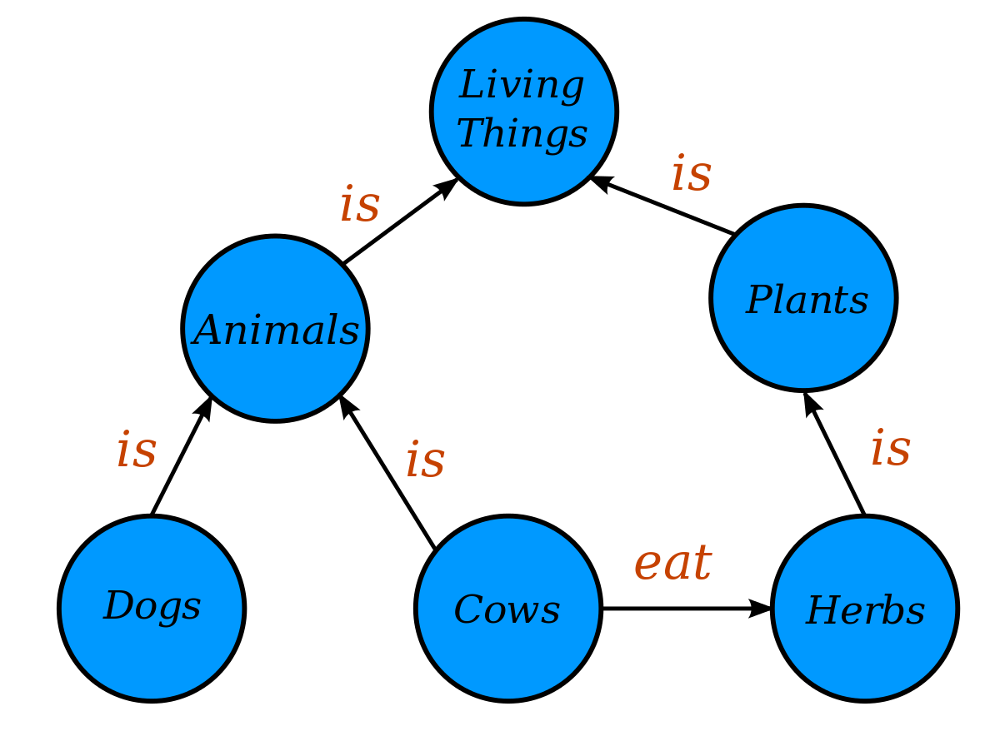

#core/artificialintelligence #core/softwaredevelopment

A knowledge graph records entities and relations. It is not itself an ontology, and a stored relation does not by itself ground the symbols used to express it. The vertices in the graph denote entities such as people, places, things, or concepts, and the edges represent relationships between them. The figure illustrates that a knowledge graph can hold both taxonomic relations, such as hierarchical “is” links, and other relations, such as “eat”; it is not limited to a taxonomy. See also [ontology and taxonomy](ontology_and_taxonomy.md), [RDF and RDFS](../../001_private/books/knowledge_graphs/rdf_vs_rdfs.md), and the [symbol grounding problem](../../001_private/books/how_to_build_a_brain/symbol_grounding_problem.md).

For example, a knowledge graph may represent the relationships between actors, movies, directors, and genres in the film industry. The actors, movies, directors, and genres are represented as vertices, and the relationships between them (such as “acted in”, “directed”, or “is a genre of”) are represented as edges.

## Components of Knowledge Graphs

### 1. Subjects

- **Definition**: The subject in a knowledge graph is the entity or concept that the statement is about.
- **Example**: In the illustrative statement “Barack Obama was born in Honolulu,” Barack Obama is the subject; this is an example, not a claim about a particular published graph.

### 2. Predicates

- **Definition**: The predicate refers to the type of relationship that connects the subject to the object.
- **Example**: In the same statement, “was born in” is the predicate.

### 3. Objects

- **Definition**: The object in a knowledge graph triplet is the entity or concept that is linked to the subject by the predicate.
- **Example**: In the statement, “Honolulu” is the object.

## How Triplets Work

- **Formation of a Triplet**: A basic unit of information in a knowledge graph is often represented as a triplet, also known as a triple, formed by combining a subject, predicate, and object. This is a general graph pattern; RDF is one way to encode it, not the definition of every knowledge graph.
- **Example of a Triplet**: In the illustrative statement “Barack Obama was born in Honolulu,” the triplet would be (Barack Obama, was born in, Honolulu).

## Importance of Triplets in Knowledge Graphs

- **Structuring Data**: Triplets provide a structured way to represent complex relationships between different entities in a graph.
- **Querying and Analysis**: They enable efficient querying and analysis of data, allowing for the extraction of meaningful insights.
