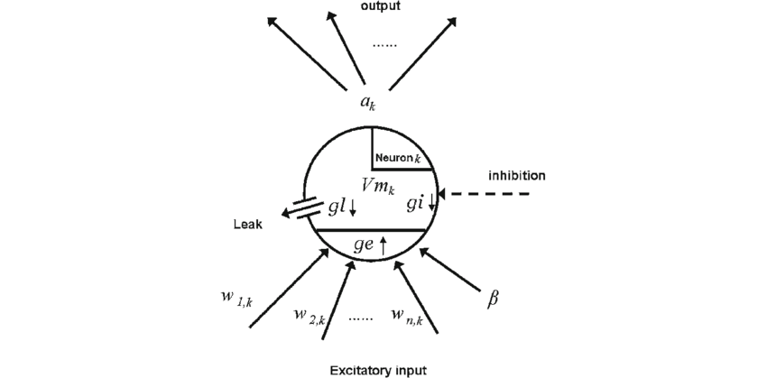

#core/biomimeticneuromorphics #core/appliedneuroscience #core/artificialintelligence

A point neuron is a **simplified mathematical model that reduces a neuron's complex spatial structure to a single compartment**, representing the membrane potential as a dimensionless point. This abstraction ignores dendritic morphology and treats all synaptic inputs as arriving at the same location.

This single-compartment abstraction deliberately trades spatial and dendritic fidelity for scalable network simulation. In the [Model Hierarchy](../../003_education/kcl/01_techniques_in_neuroscience/in_silico.md#model-hierarchy), it is therefore a purposeful lower-detail, lower-cost choice rather than a universally better or worse model. A point-neuron model can be represented and exchanged through [NeuroML](../../004_subsidiary/_general/neuroml.md), but interoperability is distinct from biological equivalence.

## Why Use Point Neurons?

- **Computational efficiency**: Enables simulation of large-scale networks (millions of neurons)
- **Mathematical tractability**: Easier to analyse dynamics and stability
- **Sufficient for many questions**: Captures essential input-output relationships

> [!note] Trade-off
> Point neurons sacrifice biophysical realism (dendritic computation, spatial integration) for scalability. For questions about dendritic processing, multi-compartment models are required.

## Common Point Neuron Models

### Integrate-and-Fire (IF)

- Simplest model: integrates input until threshold, then fires and resets
- No spike shape modelling
- Equation: $\tau_m \frac{dV}{dt} = -(V - V_{rest}) + R \cdot I(t)$

### Leaky Integrate-and-Fire (LIF)

- Adds passive membrane leak
- Most widely used in computational neuroscience
- Captures refractory period through reset mechanism

### Izhikevich Model

- Two-dimensional system with recovery variable
- Reproduces 20+ firing patterns (bursting, chattering, etc.)
- Computationally efficient; biological plausibility depends on the model's features and purpose

### Adaptive Exponential (AdEx)

- Adds exponential spike initiation and adaptation current
- Offers a compromise between added biological detail and efficiency, depending on the purpose

## Applications

- **Large-scale brain simulations**: Blue Brain Project, Human Brain Project
- **Spiking neural networks**: Neuromorphic computing
- **Theoretical neuroscience**: Network dynamics, criticality studies
- **Machine learning**: Spike-based learning algorithms

## Limitations

- **Biological fidelity**: Cannot model dendritic computation or local plasticity and may miss important spatial effects in real neurons.
- **Computational scalability**: Its reduced detail supports large networks, but the appropriate scale and cost still depend on the network, inputs, and simulation question.
- **Interoperability**: A standard representation can support exchange between tools, but it does not make a model biologically equivalent to the system represented.
- **Model assumptions**: It commonly assumes linear summation of inputs; whether that simplification is adequate is model- and purpose-dependent.

> [!tip] When to Choose Point Neurons
> Use point neurons when network-level dynamics matter more than single-cell biophysics, or when simulating populations exceeding ~10,000 neurons.
