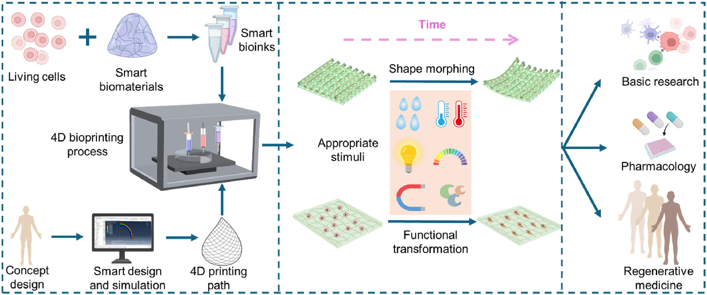

#core/appliedneuroscience 

Advanced additive manufacturing creating dynamic, **cell-laden structures that evolve over time (4th dimension)** in response to stimuli (e.g., pH, temperature, light).  

## Key Features

- **Smart materials**: Hydrogels (GelMA, alginate) or shape-memory polymers react to environmental changes.  
- **Cell integration**: Living cells embedded for biological evolution (e.g., proliferation, mechanical force exertion).  
- **Predictive design**: Mathematical models guide shape-morphing behavior.  

## Top Applications

- **Tissue engineering**: Self-shaping vascular grafts, cardiac patches, cartilage scaffolds.  
- **Drug delivery**: pH-responsive capsules, inflammation-activated micro-needles.  
- **Implants**: Temperature-triggered stents, wearable biosensors.  
- **Biorobotics**: Biohybrid actuators for diagnostics.  

## Advantages vs. 3D [Bioprinting](../../003_education/kings%20college/05%20Neuroscience%20in%20Society/Bioprinting.md)

- Dynamic adaptation mimics natural tissue behaviour.  
- Improved host integration (e.g., heart valves adjusting to physiological pressures).  

## Challenges

- Ensuring cell viability during shape changes.  
- Scalability for complex organs.  