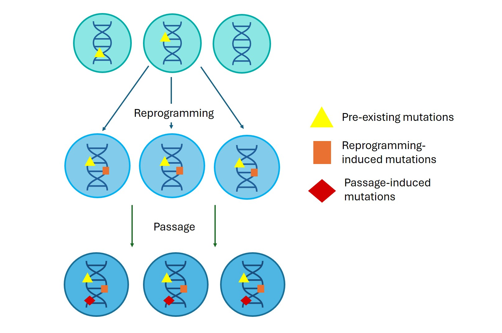

#core/appliedneuroscience 

Genetic instability is a critical concern in the field of induced pluripotent stem cell (iPSC) research and its applications in regenerative medicine. This phenomenon refers to **the accumulation of various genetic alterations during the reprogramming process and subsequent culture of iPSCs.** 

## Types of Genetic Alterations

1. **Chromosomal Aberrations**
   - Structural: deletions, duplications, inversions, translocations
   - Numerical: aneuploidy (e.g., monosomy, trisomy)

2. **Copy Number Variations (CNVs)**
   - Large-scale (>1kb) repetitions or deletions in the genome

3. **Point Mutations**
   - Single nucleotide changes: substitutions, insertions, deletions

## Consequences in iPSC Implants

- Impaired differentiation
- Increased tumour risk
- Functional alterations
- Heterogeneous cell populations
- Reduced cell viability and yield

## Implications for iPSC-Based Therapies

- Safety concerns
- Need for genetic screening
- Improved reprogramming methods
- Careful clone selection

## Relationships

- Genetic instability → Accumulation of alterations
- Alterations → Potential functional changes in iPSCs
- Functional changes → Risks in therapeutic applications
- Understanding alterations → Better safety measures and iPSC selection