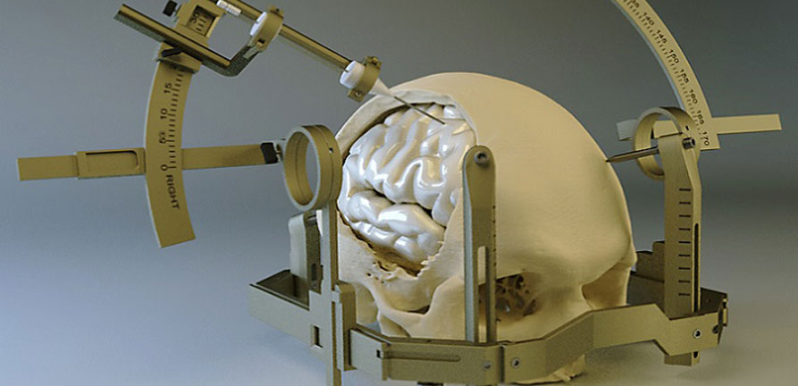

#core/theoreticalneurosurgery #core/appliedneuroscience

Stereotaxic (or stereotactic) neurosurgery is a minimally invasive surgical technique that uses **three-dimensional coordinates** and advanced imaging (MRI/CT) to precisely target structures within the brain or spine, typically with **1–2 mm accuracy**.

## Key Components

### 1. Imaging & Planning

- **Stereotactic frame** or fiducial markers attached to the skull for spatial reference.
- MRI/CT scans generate a 3D map, allowing calculation of precise coordinates for the target area.

### 2. Targeting

- **Applications**:
    - Biopsies (deep brain tissue sampling)
    - Tumour treatment (e.g., Gamma Knife radiosurgery)
    - Functional neurosurgery (e.g., Deep Brain Stimulation for Parkinson’s, epilepsy ablation)
    - [Vascular](Cortex%20vascularisation.md) malformations (e.g., arteriovenous malformations)
    - Chronic pain and psychiatric disorders (e.g., OCD, depression)

### 3. Execution

- Robotic guidance systems (e.g., ROSA®) or manual targeting.
- Small incisions for insertion of electrodes, catheters, or probes.
- Real-time imaging may be used to confirm placement.

---

## Advantages

- **High precision**: Minimises collateral damage to healthy tissue.
- **Minimally invasive**: Smaller incisions, less risk of infection.
- **Faster recovery**: Shorter hospital stays and quicker return to normal activity.
- **Versatility**: Applicable to tumours, vascular lesions, movement disorders, and psychiatric conditions.

## Limitations & Challenges

- **Brain shift**: Brain tissue may move during surgery, affecting accuracy.
- **Haemorrhage**: Rare but potentially serious complication, especially during biopsy.
- **Cost & equipment**: Requires specialised equipment and expertise.
- **Contraindications**: Severe coagulopathy, infection at entry site, or inability to undergo MRI/CT.

## Historical Context

- **1908**: Horsley & Clarke develop stereotaxy for animal research.
- **1940s**: Spiegel & Wycis adapt the technique for humans.
- **Modern era**: Frameless navigation, intraoperative [MRI](../../003_education/university%20of%20buckingham/01%20Module/NICE%20head%20injury%20guide.md#mri), and robotic assistance.