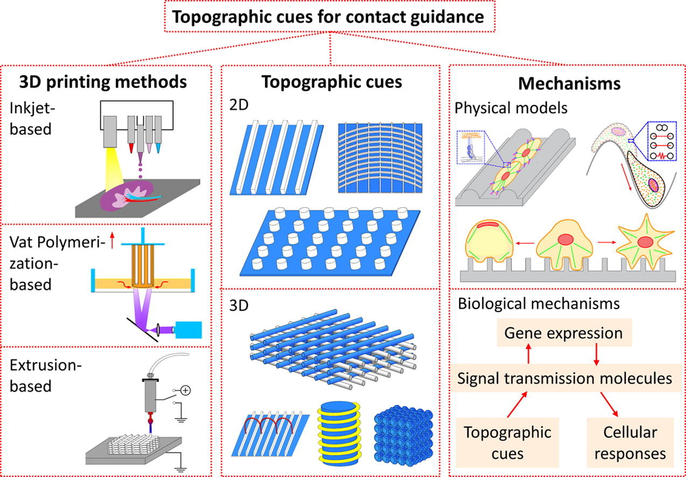

#core/biomimeticneuromorphics #core/appliedneuroscience

Topographic guidance cues are **physical features and patterns in the extracellular environment that direct cell behavior, including adhesion, migration, alignment, and differentiation** through mechanical and spatial signals.

## Key Features

- **Scale**: Nano to micro-scale features
- **Patterns**: Grooves, ridges, pillars, gratings
- **Dimensionality**: 2D and 3D structures
- **Orientation**: Aligned, random, or specific geometries

## Cellular Responses

1. **Morphological Changes**
   - Cell elongation
   - Alignment with patterns
   - Shape adaptation
   - Cytoskeletal reorganisation

2. **Behavioural Responses**
   - Directed migration
   - Enhanced adhesion
   - Controlled proliferation
   - Specific differentiation

## Mechanistic Elements

- **Focal Adhesions**: Form along topographical features
- **Actin Filaments**: Align with surface patterns
- **Filopodia**: Sense and explore topography
- **Lamellipodia**: Guide cell displacement

## Manufacturing Methods

- **Electrospinning**: Aligned fibres
- **Lithography**: Precise patterns
- **3D Printing**: Complex structures
- **Etching**: Surface modifications
