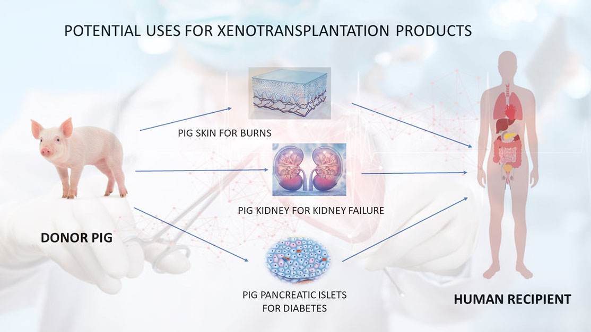

#core/appliedneuroscience 

Xenotransplantation, often abbreviated as xeno, involves the **transplantation of living cells, tissues, or organs from one species to another, typically from animals like pigs to humans**, to address organ shortages and treat medical conditions. This emerging field combines biotechnology, immunology, and ethics, aiming to overcome immune rejection and infection risks through genetic modifications, but it raises significant concerns about zoonotic diseases, animal welfare, and long-term viability.

## Key Concepts

- **Definition and Scope**: Refers to heterologous transplants between species; contrasts with allotransplantation (same species); includes whole organs, cells (e.g., islets for diabetes), or tissues.
- **History**: Dates to 17th-20th centuries with animal blood transfusions; evolved in 1960s via NASA programs; key milestones include 1980s primate experiments and recent gene-edited pig trials.
- **Benefits**: Potential to alleviate organ shortages (e.g., kidneys, hearts); uses genetically modified animals for compatibility; could treat conditions like end-stage renal disease or heart failure.
- **Risks and Challenges**: Immune rejection, transmission of zoonotic pathogens (e.g., porcine viruses), ethical issues like animal exploitation and human trial safety; high costs and uncertain long-term success.

## Examples

- **Historical**: Early attempts like lamb blood transfusions in 1667; 1920s skin grafts from chimpanzees; 1960s kidney transplants from primates.
- **Modern**: 2022 pig heart transplant to a human patient (survived 2 months); ongoing trials with gene-edited pigs for kidneys and livers; Viking Mars missions indirectly influenced early research.

> [!note] Insight on Future Viability
> While promising for bridging organ donation gaps, xenotransplantation's success hinges on mitigating bioethical and infectious risks, potentially revolutionizing medicine if regulatory hurdles are cleared.