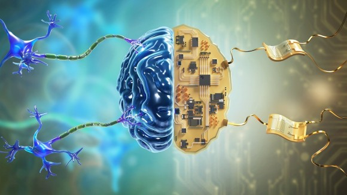

#core/biomimeticneuromorphics #core/appliedneuroscience

**Biomimetic neuromorphics** is the engineering discipline concerned with designing and fabricating physical substrates that replicate the computational architecture, dynamics, and material properties of biological neural tissue. Unlike conventional neuromorphic computing (silicon chips inspired by neurons), biomimetic neuromorphics targets functional equivalence at the tissue level—creating substrates suitable for [invariant brain emulation](invariant_brain_emulation.md) and [cognitive preservation procedures](../../001_private/_general/psnst.md).

## Synconetics Programme Context

Within the synconetics framework, biomimetic neuromorphics addresses a core engineering challenge: the synthetic neural substrate must not merely process information but do so in a manner that preserves the observables $O(f(b)) \equiv O(b)$ required for identity continuity. This demands:

- **Architectural fidelity**: Replicating [cortical column](thousand_brains_theory.md) organisation and laminar structure
- **Temporal dynamics**: Matching biological timescales for [synaptic plasticity](../../003_education/kings-college/04_biological_foundations_of_mental_health/synaptic_plasticity.md) and spike propagation
- **Interface compatibility**: Enabling seamless integration with residual biological tissue during progressive transfer
- **Substrate plasticity**: Supporting the neuroplastic reorganisation that underlies information migration

## Core Principles

### Structural [Biomimicry](../blue-brain-project/biomimicry.md)

Faithful reproduction of neural cytoarchitecture:

- Layered cortical organisation (L1–L6)
- Columnar modularity (~150,000 columns in human [neocortex](../../003_education/_general/neocortex.md))
- White matter tract topology
- Vascular and glial support structures

### Functional Equivalence

Beyond structural mimicry, the substrate must implement equivalent computations:

- Dendritic integration and nonlinear processing
- Spike timing-dependent plasticity (STDP)
- Oscillatory dynamics (theta, gamma, etc.)
- Neuromodulatory signalling

### Material Compatibility

For progressive transfer scenarios, the synthetic substrate requires:

- Biocompatible matrices supporting axonal ingrowth
- Matched mechanical properties (brain tissue ~0.5–1 kPa)
- Degradation-resistant but biologically interfaceable materials

## Key Technologies

| Technology | Role in Biomimetic Neuromorphics |
|------------|----------------------------------|
| [4D bioprinting](4d_bioprinting.md) | Fabricating organised neural tissue with temporal maturation |
| Cortical organoids | Self-organising neural structures as substrate building blocks |
| [Optoresponsive materials](optoresponsive_materials.md) | Enabling optogenetic read/write interfaces |
| [Topographic guidance cues](topographic_guidance_cues.md) | Directing axonal pathfinding for connectivity |
| [Sonogenetics](sonogenetics.md) | Non-invasive deep-tissue neural modulation |

## Challenges

### The Granularity Problem

At what level must biomimetic fidelity be maintained?

- **Molecular**: Receptor subtypes, ion channel kinetics
- **Cellular**: Morphology, intrinsic excitability
- **Circuit**: Connectivity motifs, E/I balance
- **Systems**: Functional modules, long-range integration

The [invariance criterion](invariant_brain_emulation.md) suggests circuit-level fidelity may suffice if observables are preserved, but this remains empirically untested.

### Scaling

Human cortex: ~16 billion neurons, ~150 trillion synapses. Current organoid technology produces ~10⁶ neurons. Bridging this gap requires:

- Modular assembly of organoid units
- Vascularisation for metabolic support (see [Cortex vascularisation](cortex_vascularisation.md))
- Quality control for [genetic stability](genetic_instability_in_ipscs.md)

### Consciousness Verification

No physical substrate guarantees phenomenal experience. Biomimetic neuromorphics must interface with [consciousness monitoring](../../001_private/papers/quantitative_consciousness_index.md) frameworks to validate that the synthetic tissue supports awareness.

## Why Biomimetic Neuromorphics Is Necessary

Not all gradual brain replacement approaches require biomimetic substrates. The [Moravec transfer](../../001_private/social-media/x/moravec_transfer.md), for instance, replaces neurons with nanobots that relay I/O to an external simulation computer — computation moves *out of* tissue into silicon, so the replacement hardware need not replicate neural dynamics. Biomimetic neuromorphics becomes essential specifically because [ECP](../../001_private/_general/psnst.md) keeps computation *in tissue*: the synthetic substrate must support neuroplastic reorganisation and intrinsic causal processing, not merely relay signals. This is the engineering consequence of demanding [invariance](invariant_brain_emulation.md) ($O(f(b)) \equiv O(b)$) at the substrate level rather than at a simulation level.

## Relationship to [Biomimetics](biomimetics.md)

While [Biomimetics](biomimetics.md) in tissue engineering focuses on ECM mimicry and scaffold design for regeneration, biomimetic neuromorphics specifically targets the computational and informational properties of neural tissue—not just structural repair but functional replacement capable of sustaining cognition.

## Related Concepts

- [PSNST](../../001_private/_general/psnst.md) — The cognitive preservation procedure requiring biomimetic substrates
- [Invariant brain emulation](invariant_brain_emulation.md) — Mathematical framework for substrate equivalence
- [Chimeroids](../../001_private/courses/_general/chimeroids.md) — Multi-donor synthetic neural tissue
- [Neural correlate of consciousness](../../001_private/books/the_feeling_of_life_itself/neural_correlate_of_consciousness.md) — What the substrate must ultimately support
- [Multiple realisability](../../001_private/books/how_to_build_a_brain/multiple_realisability.md) — Philosophical foundation for substrate independence
