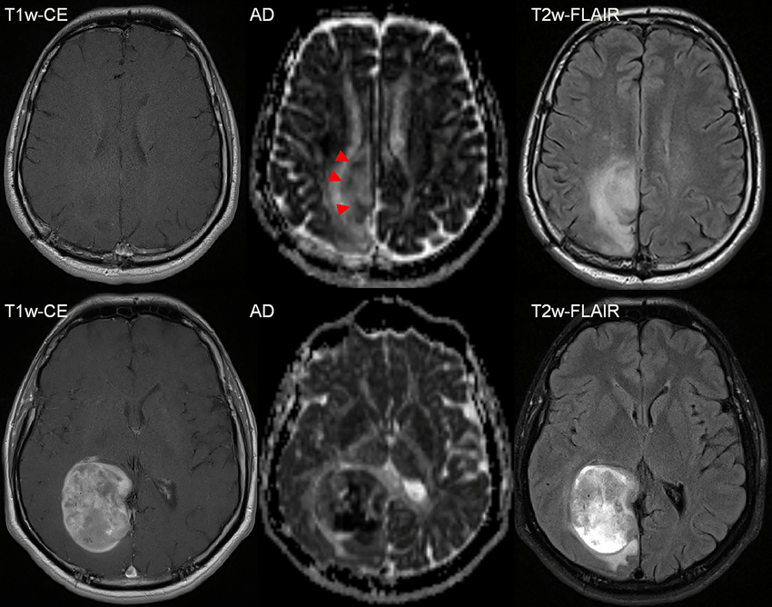

#core/appliedneuroscience

**Anaplastic transformation** is a historical and biological term for progression towards more aggressive histological or molecular features in a diffuse glioma. It is not a standalone integrated diagnosis in the current WHO Classification of Tumours of the Central Nervous System (CNS5). Biological progression can occur, but it should not be reduced to a fixed Grade II-to-III sequence.

## Molecular Foundations

Adult-type diffuse gliomas are classified into distinct integrated entities:

- **Astrocytoma, IDH-mutant** — CNS WHO grades 2–4
- **Oligodendroglioma, IDH-mutant and 1p/19q-codeleted** — CNS WHO grades 2–3
- **Glioblastoma, IDH-wildtype** — CNS WHO grade 4

An IDH mutation is an early defining alteration in the IDH-mutant diffuse-glioma classes, not a generic driver of progression across all gliomas. In astrocytoma, IDH-mutant, CNS WHO grade 4 can be assigned in the appropriate integrated diagnostic context by microvascular proliferation, necrosis, or homozygous deletion of CDKN2A/B.

Glioblastoma, IDH-wildtype may be defined molecularly as CNS WHO grade 4 by a TERT promoter mutation, EGFR amplification, or combined whole-chromosome gain of 7 and loss of 10, when the broader diagnostic context is appropriate.

## Classification Significance

Histological features such as increased nuclear atypia and proliferation may describe more aggressive tumour biology, but they do not alone establish a current CNS5 entity. Integrated classification requires the relevant histological and molecular context rather than an assumed low-grade-to-high-grade progression pathway.

These distinctions describe classification and biological concepts; they are not a diagnosis, prognosis, or treatment recommendation for an individual.

## Diagnostic and Prognostic Markers

Interpretation relies on integrated molecular profiling and histopathological assessment. The relevant markers and criteria differ between entities, so a single mutation or histological feature should not be treated as a universal marker of transformation.

## Sources

- [Louis et al. (2021)](https://doi.org/10.1093/neuonc/noab106) — WHO CNS5 classification of diffuse gliomas
- [Weller et al. (2023)](https://doi.org/10.1007/s11060-023-04250-5) — adult-type diffuse glioma classification and clinical context
