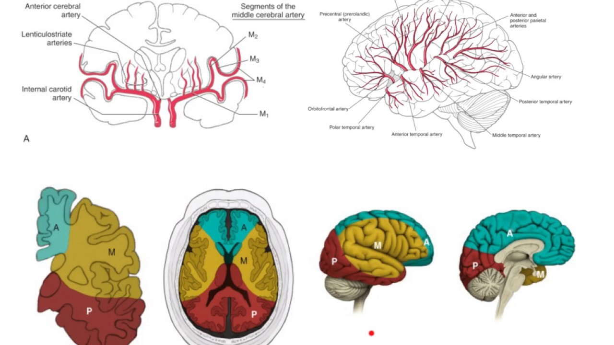

#core/appliedneuroscience

## Arterial Supply

- **Main sources**: Internal carotid arteries (anterior) and vertebral arteries (posterior)
- **Circle of Willis**: Formed at the base of the brain
- **Major arteries**:
  1. Anterior cerebral arteries
  2. Middle cerebral arteries
  3. Posterior cerebral arteries

---

## Cortical Vascular Architecture

### Leptomeningeal Vessels

- Run over the cortical surface in the leptomeningeal and subarachnoid compartment
- Form an anastomotic network
- Give rise to penetrating arterioles

### Penetrating Vessels

- Descend from the leptomeningeal network into the cortical layers
- Perivascular spaces accompany these vessels and remodel when penetrating arterioles enter the parenchyma
- Penetrating arterioles transition through precapillary segments to the capillary network

### Parenchymal Arterioles

- Are surrounded by astrocytic end-feet
- Contribute to local resistance and blood-flow regulation
- Connect with precapillary segments and the capillary network within the parenchyma

## Microvascular Organisation

### Capillary Network

- Dense, lacy network around arterioles and venules
- Forms the [blood-brain barrier](../../003_education/kcl/06_neuroimaging_in_mental_health/blood-brain_barrier.md)
- Adapts to neuronal and metabolic demands through vascular remodelling

## Functional Aspects

- Leptomeningeal vessels: May receive extrinsic innervation ([peripheral nervous system](../../004_subsidiary/courses/udemy/neuroanatomy/peripheral_nervous_system.md))
- Parenchymal vessels: Local neurovascular signalling and mural-cell regulation contribute to perfusion; the extent of direct innervation varies by vessel segment and species
- Mouse cortical evidence supports contractile sphincter-like structures and first-order capillary mural cells affecting local perfusion. Their exact prevalence, nomenclature, and translation to humans remain unresolved.

## Sources

- [Hartmann, Coelho-Santos & Shih (2022)](https://doi.org/10.1146/annurev-physiol-061121-040127) — pericyte control of blood flow across CNS microvascular zones
- [Grubb et al. (2020)](https://doi.org/10.1038/s41467-020-14330-z) — mouse cortical capillary mural-cell and sphincter-like evidence
