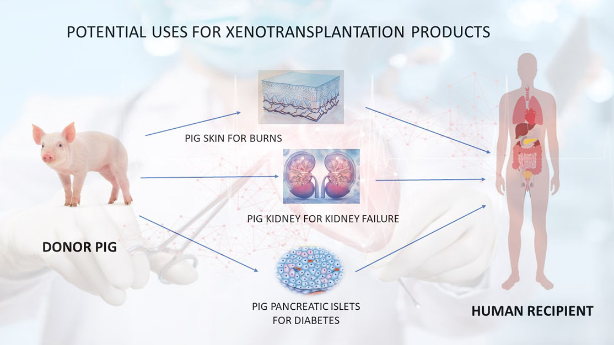

#lead/experimentalmedicine #core/appliedneuroscience

Xenotransplantation involves the **transplantation of living cells, tissues, or organs from one species to another**, typically from animals such as pigs to humans. The field combines transplantation biology, immunology, infection control, and ethics, with persistent constraints from immune rejection, zoonotic transmission, organ compatibility, and immunosuppression.

## Key Concepts

- **Definition and scope**: Refers to heterologous transplants between species; contrasts with allotransplantation between members of the same species; includes whole organs, cells such as islets, and tissues.
- **Historical development**: Early twentieth-century tissue and organ experiments preceded the best-known modern organ-transplantation attempts of the 1960s.
- **Potential applications**: Xenotransplantation has been investigated for organs, cells, and tissues where species compatibility and immune control can be addressed.
- **Risks and challenges**: Immune rejection, transmission of zoonotic pathogens, organ-size and physiological mismatch, immunosuppression, animal-welfare concerns, and uncertain long-term graft function remain central constraints.

## Historical Milestones

- **Reemtsma chimpanzee kidneys (1963–64)**: Chimpanzee kidneys were transplanted into 13 patients; one recipient survived approximately nine months.
- **Hardy chimpanzee heart (1964)**: A chimpanzee-to-human heart transplantation was performed as an early clinical experiment.
- **Starzl chimpanzee liver (1966)**: A chimpanzee-to-human liver transplantation was reported in a further early organ-xenotransplantation experiment.

These historical experiments demonstrated temporary graft function in some cases, but rejection, infection, organ-size and physiological mismatch, and the limitations of immunosuppression prevented durable clinical success.

## Translation Constraints

Assessment of xenotransplantation requires species-specific evidence on graft function, immune response, pathogen control, organ compatibility, and ethical governance. Historical outcomes do not by themselves establish present clinical safety or efficacy.

## Sources

- [Cooper (2012)](https://doi.org/10.1080/08998280.2012.11928783) / [full text](https://pmc.ncbi.nlm.nih.gov/articles/PMC3246856/) — historical xenotransplantation experiments and translational barriers
- [Matsumoto et al. (2015)](https://doi.org/10.1016/j.ijsu.2015.06.060) — xenotransplantation history and remaining challenges
