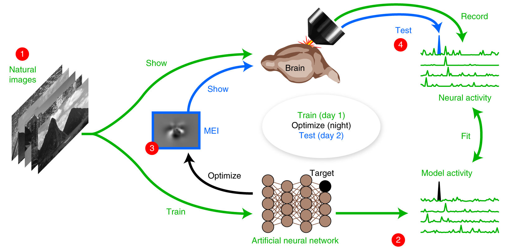

#core/appliedneuroscience 

An inception loop in neuroscience is a **closed-loop experimental paradigm** that combines **in vivo recordings with [in silico](../../003_education/kings%20college/01%20Techniques%20in%20Neuroscience/In%20silico.md) nonlinear response modelling** to identify and optimise sensory stimuli that maximally excite neurons. This technique is particularly useful for understanding how neurons process sensory information, especially in complex, nonlinear systems like the brain.

## Key Components of Inception Loops

1. **In Vivo Recordings**: Initially, researchers record the neural responses of large populations of neurons to a variety of natural stimuli using techniques such as two-photon calcium imaging. This step is typically performed on awake animals, like mice, to capture realistic neural activity patterns.

2. **[In Silico](../../003_education/kings%20college/01%20Techniques%20in%20Neuroscience/In%20silico.md) Modelling**: The recorded neural responses are then used to train deep learning models, such as convolutional neural networks (CNNs), to predict how neurons respond to different stimuli. These models serve as "[in silico](../../003_education/kings%20college/01%20Techniques%20in%20Neuroscience/In%20silico.md) avatars" of the neural populations, allowing researchers to simulate and analyse neural behaviour in a controlled environment.

3. **Stimulus Optimisation**: Using the trained models, researchers generate **Most Exciting Images (MEIs)**—stimuli that are predicted to elicit the strongest responses from specific neurons. These MEIs often exhibit complex spatial features that differ from traditional stimuli like Gabor patterns, which were previously thought to be optimal for neurons in the primary visual cortex (V1).

4. **In Vivo Verification**: The optimised MEIs are then presented back to the same neurons in the brain to verify their effectiveness. This step confirms whether the synthesised stimuli indeed drive stronger neural responses compared to control stimuli.

## Significance of Inception Loops

- **Paradigm Shift**: Inception loops offer a systematic approach to understanding neural mechanisms of sensation by directly addressing the nonlinear and high-dimensional nature of sensory processing.
- **Advancements in AI**: Insights from inception loops can be used to develop more realistic and efficient AI models by incorporating principles of biological vision and cognition.
- **Future Applications**: This technique can be extended beyond visual cortex studies to explore other sensory areas and cognitive processes, potentially revealing new aspects of neural function and organisation.
