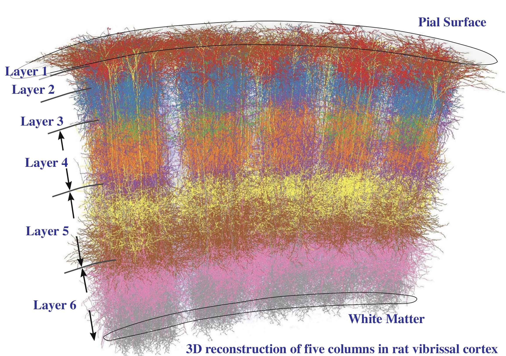

#core/appliedneuroscience

A cortical column is the basic functional unit of the [Neocortex](neocortex.md), the **outermost layer of the brain responsible for higher functions such as perception, attention, and learning.** First described by Vernon Mountcastle in 1957, each column consists of neurons arranged in a cylindrical structure spanning all six cortical layers, sharing consistent vertical connectivity and a common receptive field.
