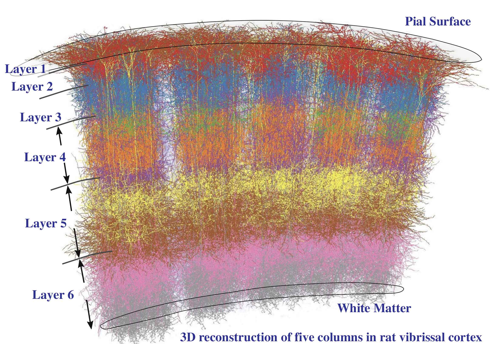

#core/appliedneuroscience

A cortical column is a **proposed functional unit of the [neocortex](neocortex.md),** first described by Vernon Mountcastle in 1957. “Column” is used for more than one anatomical scale: minicolumn dimensions and cell counts vary by region, species, and definition ([Buxhoeveden & Casanova, 2002](https://doi.org/10.1093/brain/awf110)). A ~50–100 µm diameter can be retained as a rough engineering target for a minicolumn-like module, not as a universal anatomical constant. The image above shows five columns in rat vibrissal (whisker) cortex, with Layer 4 (yellow) serving as the primary thalamic input layer.

## Scale Hierarchy

Cortical columns are discussed at multiple anatomical and functional scales:

| Scale | Diameter | Count / composition | Example |
|---|---|---|---|
| **Minicolumn** (small-scale column) | Variable; ~30–60 µm in the Hawkins et al. model | Variable | A useful term, but not a uniform census unit across all areas |
| **Larger cortical column** (Hawkins et al. model) | ~300–600 µm | 150–250 model minicolumns | A theory-level convention, not a settled universal anatomical unit |
| **Macrocolumn / hypercolumn** | Area-specific or functional | Area-specific | Orientation organisation in V1 and barrel organisation in rodent S1 are not interchangeable |

The minicolumn is often discussed as a developmental or radial unit, but its dimensions, cell counts, and relationship to response columns vary across regions, species, and operational definitions. Macrocolumns and hypercolumns are better treated as area-specific or functional aggregates; they do not provide one universal cortical tiling scheme. In Hawkins et al.'s 2017 theory model, a larger column is approximately 300–600 µm wide and contains 150–250 model minicolumns of approximately 30–60 µm. These are model conventions rather than universal anatomical facts ([Hawkins et al., 2017](https://doi.org/10.3389/fncir.2017.00081)).

The often-cited **~150,000 figure must not be treated as a census of minicolumns**. Hawkins uses approximately 150,000 as a proposal for larger cortical columns in his theory; it is not a settled anatomical count, and it cannot be multiplied by a fixed minicolumn cell count to account for the tens of billions of cortical neurons ([Hawkins et al., 2017](https://doi.org/10.3389/fncir.2017.00081)).

## Canonical Microcircuit

Within every column, information follows a broadly conserved laminar routing that repeats across virtually all neocortical areas:

1. **Layer IV** (stellate cells) — primary thalamic input
2. **Layer II/III** ([pyramidal neurons](../kcl/06_neuroimaging_in_mental_health/pyramidal_neurons.md)) — intracolumnar processing; output to other cortical columns
3. **Layer V** (large pyramidal neurons) — subcortical output (brainstem, spinal cord, striatum)
4. **Layer VI** (multiform) — feedback projection back to thalamus, closing the thalamocortical loop

This recurrent loop — the **canonical cortical circuit** — is modulated by [interneurons](../kcl/07_neurodevelopmental_disorders/interneurons.md): basket cells provide fast lateral inhibition that sharpens tuning and enforces winner-takes-most competition between neighbouring columns; chandelier cells gate pyramidal output at the axon initial segment.

See [laminar cytoarchitecture](../../001_private/_general/laminar_cytoarchitecture.md) for the full layer-by-layer cellular description.

## Functional Evidence

**Mountcastle (1957)** — recording in cat somatosensory cortex — found that vertical electrode penetrations encountered neurons responding to the same stimulus modality across depth, while oblique penetrations crossed modality boundaries, establishing the column as a modality-specific computational unit.

**Hubel & Wiesel (1962–68)** — primary visual cortex in cats and macaques — demonstrated two superimposed columnar systems:
- **Orientation columns**: neurons within a column share a preferred edge orientation; preference rotates ~10° per ~50 µm lateral step
- **Ocular dominance columns**: alternating ~500 µm bands of left-eye and right-eye dominance
- **Hypercolumn**: one complete orientation cycle + one ocular dominance pair = ~1 mm² hypercolumn — the minimal tile containing all orientation and eye preferences for a point in visual space

**Barrel cortex** (Woolsey & Van der Loos, 1970) — rodent primary somatosensory cortex — contains one discrete Layer IV "barrel" per facial whisker, with sharp cytoarchitectural boundaries visible in tangential sections. Each barrel column processes tactile input exclusively from its corresponding whisker.

> [!note] Species caveat
> Orientation and ocular dominance columns are absent in rodents (mouse, rat), where V1 contains no columnar organisation at the macrocolumn scale. Minicolumnar structure appears universal; macrocolumnar patterning is area- and species-dependent.

## The Column Debate

The column as a universal anatomical entity is contested. Horton & Adams (2005, *Philosophical Transactions of the Royal Society B*) argued that “cortical columns” can be a convenient abstraction rather than a physically defined structure — the wide variation in columnar organisation across areas and species undermines a single columnar principle ([Horton & Adams, 2005](https://doi.org/10.1098/rstb.2005.1623)). Minicolumns have anatomical grounding, but their dimensions and counts are not invariant. Hypercolumns are better treated as functional constructs, not obligate anatomical modules.

For computational and engineering purposes, minicolumn-like modules remain useful abstractions, provided that their dimensions and counts are treated as variable rather than as a universal repeating unit.

## Thousand Brains Theory

Hawkins et al. (Numenta, 2019) propose that each cortical column independently constructs a complete reference-frame-anchored model of the world, not merely a local feature detector. Under this framework:

- Every column maintains allocentric location representations (analogous to entorhinal grid cells) to build object models
- Columns vote across long-range horizontal connections to achieve consensus on a single coherent percept
- Intelligence arises, in Hawkins's proposal, from the near-identical replication of a single cortical algorithm across approximately 150,000 larger columns ([Hawkins et al., 2017](https://doi.org/10.3389/fncir.2017.00081))

See: [Thousand Brains Theory](../../002_profession/eightsix/thousand_brains_theory.md)

## Biomimetic Relevance

The columnar-laminar architecture is the **primary template for synthetic neural substrate design**. Engineering targets derived from column organisation:

- **Minicolumn modularity**: a rough 50–100 µm engineering target can support massively parallel, spatially localised computation; it must not be multiplied into a 150,000-minicolumn anatomical estimate
- **Canonical circuit replication**: the Layer IV → II/III → V → VI recurrent loop provides the minimal repeating circuit motif for engineered analogue substrates
- **Inhibitory gating**: intracolumnar basket cell inhibition enforcing winner-takes-most dynamics must be preserved to replicate attractor states and stable representations
- **Inter-column communication**: lateral long-range connections (Layers II/III) implement the voting mechanism that binds distributed column outputs into coherent representations

See: [biomimetic neuromorphics](../../002_profession/eightsix/biomimetic_neuromorphics.md)
