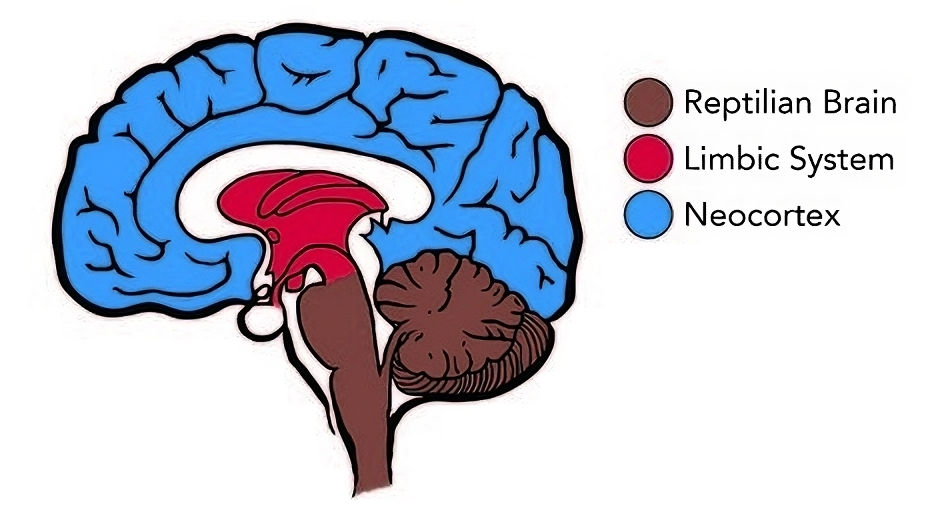

#core/appliedneuroscience

The neocortex, also called the **neopallium** or **isocortex**, is the **outermost layered structure of the mammalian brain, responsible for higher cognitive functions** including sensory perception, spatial reasoning, conscious thought, and language. As the most recently evolved region of the cerebral cortex, it is the defining feature of mammalian brains and the substrate for much of what makes human cognition distinctive.

> [!abstract] TL;DR
> The neocortex is a 6-layered, highly folded sheet of grey matter covering the cerebrum. Its ~16 billion neurons are organised into ~150,000 cortical columns, each a vertical processing unit, connected by short-range intralaminar and long-range inter-regional projections. It is the primary target of neuroimaging research (fMRI, MEG), the substrate of consciousness theories (IIT, Global Workspace), and the structural template for biomimetic neuromorphic engineering. Key atlases include BigBrain (20 µm histological resolution) and the HCP's multi-modal parcellation (180 areas per hemisphere).

## Gross Anatomy

The neocortex is a sheet of approximately **2,000 cm²** (in humans), folded into sulci (grooves) and gyri (ridges) to fit within the cranium. The degree of folding, called gyrification, increases with cortical surface area and is thought to minimise wiring length for long-range connectivity. Functionally:

- **Thickness**: ~2–4 mm, relatively uniform across areas
- **Surface area**: ~2,000 cm² (humans), ~400× greater than its exposed outer surface due to folding
- **Mass**: ~450 g (~40% of total brain mass in humans)

## Laminar Organisation

The defining structural feature of the neocortex is its **six horizontal layers**, each with distinct cell populations and connectivity patterns.

| Layer | Primary Cell Types | Input/Output |
|---|---|---|
| **I** Molecular | Dendrites, axons (sparse somata) | Horizontal/intracortical |
| **II** External granular | Small [pyramidal neurons](pyramidal_neurons.md), stellate cells | Intracortical associational |
| **III** External pyramidal | Medium pyramidal neurons | **Output**: corticocortical projections |
| **IV** Internal granular | Stellate cells, thalamocortical-recipient | **Input**: thalamic sensory relay |
| **V** Internal pyramidal | Large pyramidal neurons | **Output**: subcortical (brainstem, spinal cord) |
| **VI** Multiform | Mixed pyramidal/stellate | **Output**: thalamic feedback |

The layer-specific input/output organisation supports hierarchical processing: sensory information enters at layer IV, is processed locally, and propagates up and down the cortical hierarchy via pyramidal neuron projections. See [laminar cytoarchitecture](laminar_cytoarchitecture.md) for detailed layer descriptions.

## Cortical Columns — The Functional Unit

The neocortex's elementary computational unit is the **cortical column**, a vertically oriented module (~50-100 µm diameter, spanning all 6 layers) containing ~80-100 neurons that share similar response properties. The column hypothesis, first proposed by Mountcastle (1957), posits that the neocortex is built from ~**150,000 cortical columns** in humans.

Columns within a region share similar laminar organisation but vary in their specific functional tuning (e.g., orientation preference in V1). The [Thousand Brains Theory](thousand_brains_theory.md) extends this by proposing each column builds a complete model of the world independently, voting via long-range connections to achieve coherent perception.

See: [cortical column](cortical_column.md)

## Connectivity Architecture

Neocortical connectivity operates at two scales:

### Intralaminar (Local)

- **Horizontal/association fibres**: Run within layers II–III, connecting nearby columns (~0.5–2 mm range)
- **Thalamocortical loops**: Layer IV → layer III → layer V → thalamus → layer IV (closed feedback circuits)

### Inter-regional (Long-range)

- **Corticocortical association tracts**: Connect frontal, parietal, temporal, and occipital association areas
- **Commissural fibres** (via [corpus callosum](kings-college/05_neuroscience_in_society/corpus_callosum.md)): Connect homotopic and heterotopic regions across hemispheres
- **Projection fibres**: Layers III and V project to striatum, brainstem, and spinal cord

Connectivity topology underpins the [distributed brain](epfl/01_systems_neuroscience/distributed_brain.md) model. No single region is the seat of consciousness or cognition; function emerges from network interactions.

## Role in Consciousness

The neocortex features prominently in major consciousness theories:

- **Integrated Information Theory (IIT)**: Posits that the neocortex, particularly posterior cortical areas, generates the highest integrated information (Φ) in the brain. Consciousness _is_ the system's capacity for irreducible information integration. See: [integrated information theory](001_private/videos/integrated_information_theory.md)
- **Global Workspace Theory (GWT)**: Proposes that conscious access occurs when information is broadcast globally across prefrontal-parietal neocortical networks. See: [neural correlate of consciousness](001_private/books/the_feeling_of_life_itself/neural_correlate_of_consciousness.md)
- **Higher-order Theories**: Cortical prefrontal regions monitor and represent lower-level states, generating metacognitive access to experience

## Clinical and Surgical Relevance

The neocortex is the target of:

- **Epilepsy surgery**: [Hemispherotomy](001_private/books/sizing_up_consciousness/hemispherotomy.md) — disconnecting or removing one hemisphere — demonstrates that half the neocortical substrate can sustain full conscious experience, supporting substrate-independence arguments
- **Awake [craniotomy](../../001_private/books/the_feeling_of_life_itself/craniotomy.md)**: Direct cortical stimulation maps eloquent cortex during neurosurgical procedures. See: [craniotomy](001_private/books/the_feeling_of_life_itself/craniotomy.md)
- **Disorders of consciousness**: Vegetative state ([apallic syndrome](001_private/books/sizing_up_consciousness/apallic_syndrome.md)) reflects neocortex-brainstem disconnection; quantitative measures (EEG, PCI) assess residual neocortical integration

## Research and Atlases

Your computational neuroanatomy and brain atlas research intersects with neocortex at multiple levels.

### Histological Atlases

- **BigBrain** (Amunts et al., 2013, _Science_): First 3D histological reconstruction at **20 µm isotropic resolution**, revealing cellular-layer architecture across the entire human neocortex. Enables voxel-wise comparison with in vivo MRI.

### In Vivo Parcellations

- **Human Connectome Project** (Van Essen et al., 2012, _NeuroImage_): Multi-modal MRI framework mapping structural and functional connectivity in 1,200 adults
- **Glasser et al. (2016, _Nature_)**: 180-area per hemisphere parcellation using HCP data. Areas bounded by sharp changes in architecture, function, connectivity, and topography

### Population Atlases

- **MNI/ICBM AVG152**: Probabilistic stereotaxic template based on 152 MRI scans. See: [Talairach and MNI templates](kings-college/06_neuroimaging_in_mental_health/talairach_atlas_and_mni-icbm_avg152.md)
- **CerebrA** (Collins et al., 2020, _Scientific Data_): Cortical and subcortical labeling registered to MNI-ICBM2009c

## Biomimetic Neuromorphics

The neocortex's laminar-columnar architecture is the **template for synthetic neural substrate engineering**. Biomimetic neuromorphics targets:

- **Architectural fidelity**: Replicating 6-layer lamination and columnar modularity (~150,000 columns in human neocortex). See: [biomimetic neuromorphics](002_profession/eightsix-science/biomimetic_neuromorphics.md)
- **Temporal dynamics**: Matching synaptic plasticity timescales (LTP/LTD) and oscillatory dynamics (theta, gamma)
- **Scaling challenge**: Human neocortex = ~16B neurons, ~150T synapses. Current organoid technology produces ~10⁶ neurons. Bridging this gap is the central engineering challenge

## Evolutionary Context

The neocortex is the culmination of [cephalisation](001_private/books/_general/cephalisation.md), the evolutionary trend toward centralising sensory and processing structures in the head. Mammals evolved the neocortex as a 6-layered structure, expanding the older 3-layered allocortex (hippocampus, olfactory cortex). The expansion of neocortical area, particularly in primates, underlies the cognitive capacities that distinguish mammals.

## Scales of Organisation

The neocortex operates across multiple scales:

| Scale | Structure | Function |
|---|---|---|
| **Molecular** | Ion channels, receptors, neurotransmitters | Synaptic transmission, plasticity |
| **Cellular** | Pyramidal neurons, [interneurons](../kings-college/07_neurodevelopmental_disorders/interneurons.md) | Excitation/inhibition balance, integration |
| **Circuit** | Cortical columns, layers | Local feature extraction, hierarchical processing |
| **Regional** | Frontal, parietal, temporal, occipital lobes | Domain-specialised processing |
| **Network** | Resting-state networks, long-range tracts | Global integration, consciousness |

See: [scales of neuronal organisation](kings-college/06_neuroimaging_in_mental_health/scales_of_neuronal_organisation.md)
