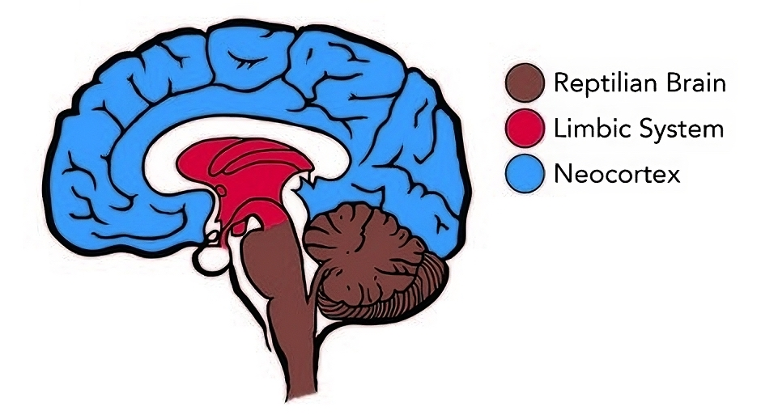

#core/appliedneuroscience

The neocortex, also called the **neopallium** or **isocortex**, is an evolutionarily expanded component of the mammalian cerebral cortex. Its canonical eulaminate pattern is conventionally described as six layers, but cortical areas vary substantially and the cerebral cortex also includes allocortical organisations with different laminar patterns ([García-Cabezas et al., 2019](https://pmc.ncbi.nlm.nih.gov/articles/PMC6500485/)). The neocortex contributes to sensory, motor, associative, and cognitive functions within distributed cortical and subcortical systems; these functions are not exclusive to it.

> [!abstract] TL;DR
> The neocortex is an evolutionarily expanded, highly folded component of mammalian cerebral cortex. Its canonical eulaminate pattern has six layers, with area-specific deviations and distinct allocortical organisations elsewhere in the cerebral cortex. An isotropic-fractionation estimate by Azevedo et al. places the human cerebral cortex at ~16 billion neurons; this is not a precise standalone neocortex census ([Azevedo et al., 2009](https://doi.org/10.1002/cne.21974)). Columnar organisation is multiscale and debated; Hawkins's theory uses approximately 150,000 larger cortical columns, not a census of minicolumns. BigBrain is a high-resolution reconstruction of one human brain, while HCP resources support population-level multimodal analysis and Glasser et al.'s MMP1.0 defines 180 cortical areas per hemisphere.

## Gross Anatomy

The human neocortex has a rough reference estimate of **~2,000 cm² across both hemispheres**, but this is not a universal average or the same measurement as the reconstruction below; estimates vary substantially with individual anatomy and measurement method. In a reconstructed Visible Man neocortex, Van Essen & Drury (1997) measured **1,570 cm² across both hemispheres**, noting that this may be a slight underestimate; about **70% was buried in sulci**, implying a total-to-exposed-area ratio of roughly **3** for that reconstruction rather than a universal constant ([Van Essen & Drury, 1997](https://doi.org/10.1523/JNEUROSCI.17-18-07079.1997)). The neocortex is folded into sulci (grooves) and gyri (ridges) to fit within the cranium. The degree of folding, called gyrification, increases with cortical surface area and is thought to minimise wiring length for long-range connectivity.

- **Thickness**: ~2–4 mm, relatively uniform across areas

## Laminar Organisation

The canonical **eulaminate pattern** is conventionally described as six horizontal layers, each with distinct cell populations and connectivity patterns. Cortical areas vary: agranular and dysgranular regions have a rudimentary or absent layer IV, while allocortical regions of the cerebral cortex have different laminar organisations ([García-Cabezas et al., 2019](https://pmc.ncbi.nlm.nih.gov/articles/PMC6500485/)).

| Canonical eulaminate layer | Primary Cell Types | Common input/output tendency |
|---|---|---|
| **I** Molecular | Dendrites, axons (sparse somata) | Horizontal/intracortical |
| **II** External granular | Small [pyramidal neurons](../kcl/06_neuroimaging_in_mental_health/pyramidal_neurons.md), stellate cells | Intracortical associational |
| **III** External pyramidal | Medium pyramidal neurons | Mainly corticocortical and callosal projections |
| **IV** Internal granular | Stellate cells, thalamocortical-recipient | Common thalamic sensory input |
| **V** Internal pyramidal | Large pyramidal neurons | Major subcortical output, including brainstem and spinal targets |
| **VI** Multiform | Mixed pyramidal/stellate | Prominent corticothalamic feedback |

The layer-specific input/output organisation can be summarised by a simplified canonical schema for granular sensory cortex: information commonly enters via layer IV, engages layers II–III, and propagates through layers V–VI. Actual pathways are recurrent, parallel, and area-dependent; agranular and dysgranular regions do not fully conform. See [laminar cytoarchitecture](../../001_private/_general/laminar_cytoarchitecture.md) for detailed layer descriptions.

## Cortical Columns — Proposed Anatomical and Functional Groupings

The neocortex has proposed columnar organisation at multiple scales, but **“cortical column” is not a settled universal anatomical or functional unit**. Minicolumn dimensions and cell counts vary by region, species, and definition ([Buxhoeveden & Casanova, 2002](https://doi.org/10.1093/brain/awf110)). Hawkins's ~150,000 figure refers to larger theory columns, not to 150,000 minicolumns. In his 2017 model, columns are approximately 300–600 µm and contain 150–250 model minicolumns of approximately 30–60 µm; these are model conventions rather than universal anatomical facts ([Hawkins et al., 2017](https://doi.org/10.3389/fncir.2017.00081)).

Area-specific arrangements such as orientation columns in V1 and barrel organisation in rodent S1 can be valid empirical cases without establishing one universal columnar architecture. The [Thousand Brains Theory](../../002_profession/eightsix/thousand_brains_theory.md) extends the column hypothesis by proposing that each larger column builds a complete model of the world independently, voting via long-range connections to achieve coherent perception.

Horton & Adams (2005) emphasised that “cortical column” can also function as a useful abstraction rather than a single physically defined structure; columnar organisation should therefore be interpreted at the relevant area, species, and scale ([Horton & Adams, 2005](https://doi.org/10.1098/rstb.2005.1623)).

See: [cortical column](cortical_column.md)

## Connectivity Architecture

Neocortical connectivity operates across reciprocal, partly parallel, area- and layer-dependent pathways:

### Local and laminar pathways

- **Local and intralaminar fibres**: Layers II–III mainly support intracortical, corticocortical, and callosal communication; local horizontal/association fibres connect nearby columns (~0.5–2 mm range)

### Thalamocortical pathways

- **Thalamocortical pathways**: Layer IV is commonly thalamorecipient, while layer VI provides prominent corticothalamic feedback; input and output arrangements vary with cortical area and thalamic nucleus

### Inter-regional (Long-range)

- **Corticocortical association tracts**: Connect frontal, parietal, temporal, and occipital association areas
- **Commissural fibres** (via [corpus callosum](../kcl/05_neuroscience_in_society/corpus_callosum.md)): Connect homotopic and heterotopic regions across hemispheres
- **Subcortical projections**: Layer V is a major source of subcortical output, including brainstem and spinal projections, and contributes to higher-order thalamic projections where applicable. Corticostriatal neurons span especially layers III and V, with distributions varying by region

Connectivity topology supports the [distributed brain](../epfl/distributed_brain.md) view: specialised cortical and subcortical networks interact, and which function depends on a region, network, and scale is task- and theory-dependent ([Mesulam, 1998](https://doi.org/10.1093/brain/121.6.1013)). Anatomy alone does not settle the basis or location of cognition or consciousness.

## Consciousness Research and Theories

Neocortical activity is studied in empirical neural correlates of consciousness (NCC) research, while theories interpret those findings differently. None of the following establishes a settled anatomical account:

- **NCC research**: Seeks neural activity and organisation reliably associated with conscious states; association does not by itself establish a sufficient or exclusive substrate. See: [neural correlate of consciousness](../../001_private/books/the_feeling_of_life_itself/neural_correlate_of_consciousness.md)
- **Integrated Information Theory (IIT)**: Proposes that consciousness relates to integrated information in a specified causal system; claims about posterior cortical areas are theory-specific and contested. See: [integrated information theory](../../001_private/videos/integrated_information_theory.md)
- **Global Workspace Theory / Global Neuronal Workspace Theory (GWT/GNWT)**: Proposes that conscious access occurs when information is globally broadcast, often across frontoparietal networks.
- **Higher-order theories (HOT)**: Propose that conscious states involve representations of other mental states, often implicating prefrontal processes; these hypotheses remain contested.

## Clinical and Surgical Relevance

The neocortex is the target of:

- **Epilepsy surgery**: [Hemispherotomy](../../001_private/books/sizing_up_consciousness/hemispherotomy.md) — in selected clinical cases, unilateral pathology and surgical disconnection show biological resilience and possible functional reorganisation. This does not establish material substrate independence, unchanged phenomenal experience, or literal 50% removal
- **Awake [craniotomy](../../001_private/books/the_feeling_of_life_itself/craniotomy.md)**: Direct cortical stimulation maps eloquent cortex during neurosurgical procedures.
- **Disorders of consciousness**: Unresponsive wakefulness syndrome (UWS; formerly vegetative state or apallic syndrome) involves heterogeneous dysfunction across cortical, corticocortical, corticothalamic, thalamic, and brainstem/subcortical systems, rather than a single neocortex–brainstem disconnection ([Laureys et al., 2010](https://doi.org/10.1186/1741-7015-8-68)). PCI is a TMS–EEG perturbational-complexity measure with studied clinical state-discrimination evidence, not a direct measure of residual neocortical integration or consciousness ([Casali et al., 2013](https://doi.org/10.1126/scitranslmed.3006294)).

## Research and Atlases

Computational neuroanatomy and brain-atlas research intersect with the neocortex at multiple levels.

### Histological Atlases

- **BigBrain** (Amunts et al., 2013, _Science_): 3D histological reconstruction of **one human brain** at **20 µm isotropic resolution**, based on 7,404 sections. It supports cellular-layer analysis and comparison with in vivo MRI but is not a population atlas ([Amunts et al., 2013](https://doi.org/10.1126/science.1235381)).

### In Vivo Parcellations

- **Human Connectome Project (HCP)**: Multimodal MRI and connectivity datasets and resources for population-level analysis.
- **Glasser et al. (2016, _Nature_)**: MMP1.0, a multimodal parcellation defining **180 cortical areas per hemisphere** using architectural, functional, connectivity, and topographic evidence ([Glasser et al., 2016](https://doi.org/10.1038/nature18933)).

### Population Atlases

- **MNI/ICBM AVG152**: Probabilistic stereotaxic template based on 152 MRI scans. See: [Talairach and MNI templates](../kcl/06_neuroimaging_in_mental_health/talairach_atlas_and_mni-icbm_avg152.md)
- **CerebrA** (Collins et al., 2020, _Scientific Data_): Cortical and subcortical labelling registered to MNI-ICBM2009c

## Biomimetic Neuromorphics

Neocortical lamination, local recurrent circuitry, and long-range connectivity provide useful biological reference points for biomimetic engineering, not a settled blueprint. Anatomical replication alone would not establish equivalent computation, cognition, or consciousness. The following are conditional, scale-, area-, and model-specific targets; layers, columns, and cell counts are reference parameters, not fixed anatomical specifications or identity-preservation criteria:

- **Architectural fidelity**: A project may model canonical lamination and multiscale columnar modularity; Hawkins's proposal uses ~150,000 larger columns, not a settled minicolumn census. See: [biomimetic neuromorphics](../../002_profession/eightsix/biomimetic_neuromorphics.md)
- **Temporal dynamics**: A model may target synaptic plasticity timescales (LTP/LTD) and oscillatory dynamics (theta, gamma), depending on its biological question
- **Scaling challenge**: Neuron-count scale is one engineering challenge: Azevedo et al.'s isotropic-fractionation estimate for the human cerebral cortex is ~16B neurons, not a precise standalone neocortex census; ~150T synapses are also often cited. Current organoid technology produces ~10⁶ neurons.

## Evolutionary Context

The neocortex/isocortex is an evolutionarily expanded component of mammalian cerebral cortex, alongside allocortical regions with different laminar organisations. Its area and specialisation vary across mammalian species; associations with cognition should be treated as contributions within distributed systems rather than as exclusive causes. See [cephalisation](../../001_private/books/_general/cephalisation.md) for the broader evolutionary context.

## Scales of Organisation

The neocortex operates across multiple scales:

| Scale | Structure | Function |
|---|---|---|
| **Molecular** | Ion channels, receptors, neurotransmitters | Synaptic transmission, plasticity |
| **Cellular** | Pyramidal neurons, [interneurons](../kcl/07_neurodevelopmental_disorders/interneurons.md) | Excitation/inhibition balance, integration |
| **Circuit** | Cortical layers and proposed columnar groupings | Local and hierarchical processing |
| **Regional** | Frontal, parietal, temporal, occipital lobes | Domain-specialised processing |
| **Network** | Resting-state networks, long-range tracts | Distributed integration and state-dependent functions |

See: [scales of neuronal organisation](../kcl/06_neuroimaging_in_mental_health/scales_of_neuronal_organisation.md)
