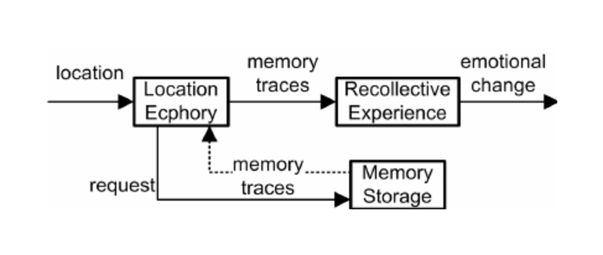

#core/appliedneuroscience

Ecphory is a **cognitive process involving retrieving memories by activating the neural patterns representing an [engram](../../../001_private/videos/Engram.md)** in response to specific cues (also called [Engram](../../../001_private/videos/Engram.md)). **Origin**: The term was introduced by [Endel Tulving](https://en.wikipedia.org/wiki/Endel_Tulving), a key figure in studying human memory.

## Process of Ecphory

- **Interaction with Cues**: Ecphory occurs when external stimuli or internal thoughts provide cues that match or closely resemble the context in which the memory was initially encoded.
- **Triggering [Memory](../../kings%20college/02%20Psychological%20Foundations/Working%20memory%20model.md) Recall**: These cues trigger the neural mechanisms that ‘awaken’ the [engram](../../../001_private/videos/Engram.md), allowing for the conscious recollection of the memory.

## Ecphory vs. [Engram](../../../001_private/videos/Engram.md)

- **[Engram](../../../001_private/videos/Engram.md)**: Represents the physical storage of memory as neural connections within the brain.
- **Ecphory**: Refers to the retrieval mechanism that reactivates these stored engrams, bringing memories into conscious awareness.

## Importance of Ecphory

- **Contextual Dependence**: Ecphory highlights the importance of contextual cues in memory retrieval. The closer the match between the retrieval cue and the original encoding situation, the more likely the memory will be successfully recalled.
- **Reconstruction of Memories**: It suggests that memory recall is a reconstructive process, where memories are pieced together from engrams in response to cues.
