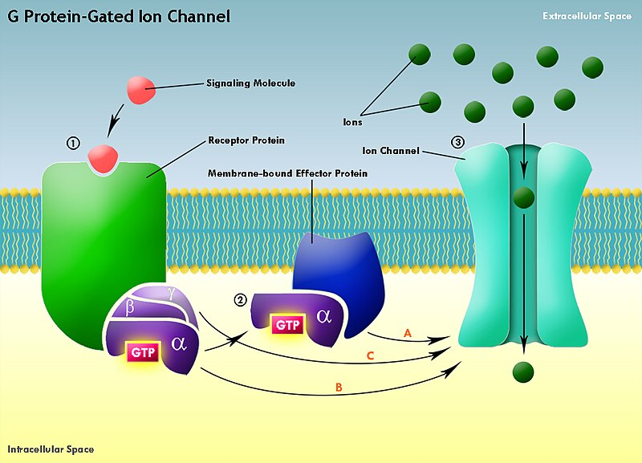

#core/appliedneuroscience

Effector proteins play **pivotal roles in the signalling pathways within neurons, acting as critical mediators in translating extracellular signals into functional cellular responses.** These proteins are integral to the neuron’s ability to process information, respond to environmental cues, and maintain homeostasis. Their functions are diverse, from activating enzyme cascades to altering ion channel states and gene expression.

## Key Functions

- **Signal Transduction**: Effector proteins are central to the signal transduction mechanisms that enable neurons to respond to neurotransmitters and other extracellular signals. They often operate within complex signalling cascades, where the binding of a neurotransmitter to its receptor activates a G-protein, which in turn activates an effector protein.
- **[Ion Channel](../../kings%20college/01%20Techniques%20in%20Neuroscience/Ion%20channels.md) Regulation**: Many effector proteins directly regulate [ion channels](../../kings%20college/01%20Techniques%20in%20Neuroscience/Ion%20channels.md), altering the neuron’s membrane potential and influencing neurotransmission. For example, activating certain effector proteins can lead to the opening or closing of [ion channels](../../kings%20college/01%20Techniques%20in%20Neuroscience/Ion%20channels.md), impacting neuronal excitability and [synaptic plasticity](../../kings%20college/04%20Biological%20Foundations%20of%20Mental%20Health/Synaptic%20plasticity.md).
- **Gene Expression**: Effector proteins such as transcription factors can regulate gene expression in response to neuronal activity. This function is crucial for long-term [synaptic plasticity](../../kings%20college/04%20Biological%20Foundations%20of%20Mental%20Health/Synaptic%20plasticity.md), neuronal development, and the maintenance of the neuronal phenotype.
- **Enzymatic Activity**: Some effector proteins exert their effects through enzymatic activity, catalysing biochemical reactions within the neuron. This includes the activation of kinases or phosphatases that modulate the phosphorylation state of proteins, affecting their function and interaction with other cellular components.

## Examples

1. **Adenylyl Cyclase**: An effector protein activated by G-proteins that catalyses the conversion of ATP to cyclic AMP (cAMP), a secondary messenger involved in a wide range of cellular processes, including memory formation and [synaptic plasticity](../../kings%20college/04%20Biological%20Foundations%20of%20Mental%20Health/Synaptic%20plasticity.md).
2. **Phospholipase C (PLC)**: Another effector activated by G-proteins, PLC catalyses the breakdown of phosphatidylinositol 4,5-bisphosphate (PIP2) into diacylglycerol (DAG) and inositol triphosphate (IP3), leading to the release of calcium from intracellular stores and the activation of protein kinase C (PKC).
3. **[Ion Channels](../../kings%20college/01%20Techniques%20in%20Neuroscience/Ion%20channels.md)**: Certain [ion channels](../../kings%20college/01%20Techniques%20in%20Neuroscience/Ion%20channels.md) act as effector proteins, directly responding to signals by altering their conformation and conductivity. This includes ligand-gated [ion channels](../../kings%20college/01%20Techniques%20in%20Neuroscience/Ion%20channels.md) and voltage-gated [ion channels](../../kings%20college/01%20Techniques%20in%20Neuroscience/Ion%20channels.md), critical for synaptic transmission and action potential propagation.
