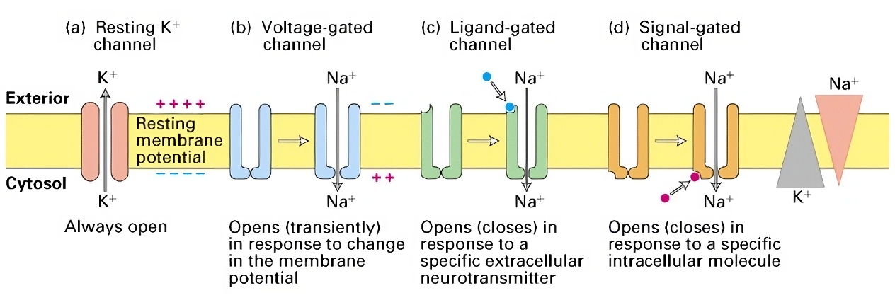

#core/appliedneuroscience

 

[Membrane](../../kings-college/01_techniques_in_neuroscience/resting_membrane_potential.md) channels are **integral components of synapses, enabling the flow of ions across the neuronal membrane**, which is crucial for initiating and propagating electrical signals.

## [Synaptic](../../kings-college/04_biological_foundations_of_mental_health/pre-_and_post-synaptic.md) Transmission

- **Chemical [Synapses](../../kings-college/04_biological_foundations_of_mental_health/types_of_synapses.md)**: These are specialised for the release and reception of neurotransmitters. They consist of a presynaptic ending that contains neurotransmitters, mitochondria, and other cell organelles; a postsynaptic ending that contains receptor sites for neurotransmitters; and a synaptic cleft, the space between the presynaptic and postsynaptic endings.
- **Electrical Synapses**: Less common than chemical synapses, electrical synapses pass ions and signalling molecules directly between neurons through gap junctions. They allow for rapid and bidirectional signalling.

## Membrane Channels

Membrane channels are protein structures that allow ions to pass in and out of neurons, contributing to the [resting membrane potential](../../kings-college/01_techniques_in_neuroscience/resting_membrane_potential.md) and the generation of action potentials.

- **Resting K+ Channels**: These are selectively permeable to K+ ions and are always open, allowing K+ to move freely across the membrane, contributing to the [resting membrane potential](../../kings-college/01_techniques_in_neuroscience/resting_membrane_potential.md).
- **Voltage-Gated Channels**: These channels open or close in response to changes in membrane potential. Voltage-gated Na+ channels are crucial for the rising phase of the action potential, while voltage-gated K+ channels contribute to repolarisation and hyperpolarisation.
- **Ligand-Gated Channels**: Open or close in response to the binding of a neurotransmitter or other ligands. These are essential for postsynaptic signalling.
- **Signal-Gated Channels**: Also known as metabotropic channels, these open or close in response to intracellular signals, such as a second messenger cascade triggered by the activation of a G-protein-coupled receptor.

## Functional Significance

- **Resting Membrane [Potential](../../kings-college/01_techniques_in_neuroscience/resting_membrane_potential.md)**: Established by the differential distribution of ions across the neuronal membrane, particularly due to K+ and Na+ ions through their respective channels.
- **Action Potentials**: Generated by the rapid opening and closing of voltage-gated Na+ and K+ channels, allowing neurons to transmit signals over long distances.
- **Synaptic Integration**: Occurs when a neuron processes all incoming synaptic inputs, facilitated by various types of [ion channels](../../kings-college/01_techniques_in_neuroscience/ion_channels.md) that determine the postsynaptic potential.
- **Neuroplasticity**: The ability of synapses to strengthen or weaken over time, which is fundamental for learning and memory, is influenced by the activity of membrane channels and the resulting calcium influx.
