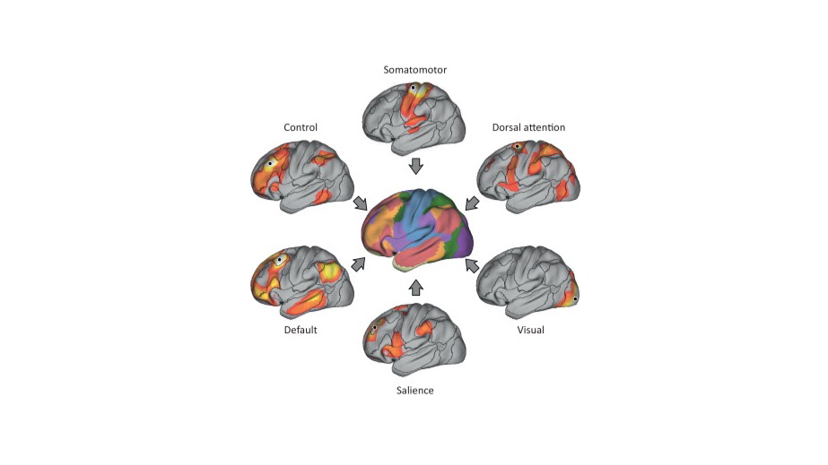

#core/appliedneuroscience

**Distributed processing** describes how behaviours and cognitive functions arise from interactions among specialised regions and subnetworks rather than from one isolated centre. It does not mean that every region contributes equally or that no region can be necessary: lesions and perturbations can reveal indispensable nodes, while each contribution depends on task, context, and timescale (Mesulam, 1998).

The embedded figure is a schematic of overlapping network systems, not an anatomical wiring diagram or a tennis circuit.

## Network concepts

- **Structural connectivity**: Anatomical pathways linking regions and subnetworks.
- **Functional connectivity**: Statistical dependence between activity patterns, without by itself specifying direction or causation.
- **Effective connectivity**: Directed causal influence estimated through a model or perturbation.

These forms of connectivity constrain one another but are not interchangeable. Network function depends on the interaction between regional specialisation and distributed integration (Sporns, 2013).

## Tennis as a Distributed Perception–Action Loop

The perception–action distinction provides a useful organising principle for this example (Goodale & Milner, 1992):

- **Visual and dorsal pathways**: [Visual processing](../kcl/02_psychological_foundations/visual_search.md) estimates the ball’s movement and supports visually guided action; there is no single motion centre.
- **Parietal and premotor systems**: Integrate visual, body, and task information to plan posture, reach, and action.
- **Motor output**: Primary motor cortex, brainstem, and spinal circuits contribute to descending control; movement is continuously adjusted rather than produced by M1 alone.
- **Cerebellum**: Supports predictive calibration, timing, and error correction.
- **[Basal ganglia](../kcl/04_biological_foundations_of_mental_health/basal_ganglia.md)**: Contribute to action selection, reinforcement, and skill learning. “Muscle memory” is a behavioural shorthand, not literal storage of the stroke in muscle tissue.
- **Sensory feedback**: Visual, vestibular, cutaneous, and proprioceptive signals update estimates of body state and movement.
- **Autonomic and contextual systems**: The hypothalamus and brainstem help regulate autonomic state; the amygdala contributes to context-dependent threat and salience rather than acting as a simple heart-rate controller. The hippocampus supports episodic and contextual memory but is not necessarily required for moment-to-moment execution of a learned stroke.

## Evidence and causal inference

Activation and connectivity measures can show involvement or association, but do not alone establish necessity or sufficiency. Lesions, stimulation, and other perturbations can provide more direct causal constraints; carefully designed task contrasts and convergent behavioural evidence sharpen interpretation but remain association-based. All evidence remains dependent on context and network state. This network-level view complements the [neocortex](../_general/neocortex.md) note without implying that local specialisation is unreal or that every function is equally distributed.

## Sources

- M-Mesulam (1998), “From sensation to cognition”, _Brain_ 121:1013–1052 — [doi:10.1093/brain/121.6.1013](https://doi.org/10.1093/brain/121.6.1013)
- Olaf Sporns (2013), “Structure and function of complex brain networks”, _Dialogues in Clinical Neuroscience_ 15:247–262 — [doi:10.31887/DCNS.2013.15.3/osporns](https://doi.org/10.31887/DCNS.2013.15.3/osporns)
- Goodale & Milner (1992), “Separate visual pathways for perception and action”, _Trends in Neurosciences_ 15:20–25 — [doi:10.1016/0166-2236(92)90344-8](https://doi.org/10.1016/0166-2236(92)90344-8)
