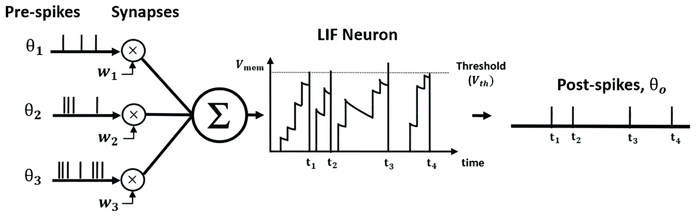

#core/appliedneuroscience #core/artificialintelligence

The Leaky Integrate-and-Fire (LIF) model is a **specific point-neuron model** used in computational neuroscience. It combines passive membrane leak with threshold-and-reset dynamics. Relative to the [Hodgkin-Huxley model](hodgkin-huxley_model.md), LIF usually occupies a lower-fidelity, lower-cost position on the fidelity-versus-cost spectrum; this is a purposeful trade-off, not a claim that it is universally better.

LIF is one example of the [point-neuron model](../../002_profession/bluebrain/point_neuron.md) family. It is also situated in the [Computational Neural Models Cluster](../kcl/01_techniques_in_neuroscience/in_silico.md#computational-neural-models-cluster), while [NeuroML](../../004_subsidiary/_general/neuroml.md) addresses representation and exchange rather than determining a model's biological fidelity or computational cost.

## Core Concept

In the LIF model, a neuron is represented as a simple electrical circuit with a capacitor (representing the cell membrane) in parallel with a resistor (the membrane’s resistance to the flow of current). The neuron integrates incoming signals and generates an output (a ‘fire’) when the membrane potential reaches a certain threshold.

## Equations

The dynamics of the membrane potential $V$ in the LIF model are described by:

$$
\tau_m \frac{dV}{dt} = - (V - V_{\mathrm{rest}}) + R_m I_e
$$

where:

- $\tau_m = R_m C_m$ is the membrane time constant,
- $R_m$ is the membrane resistance,
- $C_m$ is the membrane capacitance,
- $V_{rest}$ is the [resting membrane potential](../kcl/01_techniques_in_neuroscience/resting_membrane_potential.md),
- $I_e$ is the external current.

When $V$ reaches the threshold voltage $V_{threshold}$, the neuron fires an action potential, and $V$ is reset to the resting potential $V_{rest}$

## Fire and Reset

The ‘fire’ condition is represented as:

$$
\text{if } V \geq V_{\mathrm{threshold}}, \text{ then } V \leftarrow V_{\mathrm{reset}}
$$

> [!example] Applications
> The LIF model is widely used in the study of neural networks and in the field of neuromorphic engineering. Its simplicity allows for the simulation of large networks of neurons, making it a powerful tool for exploring principles of neural computation.
