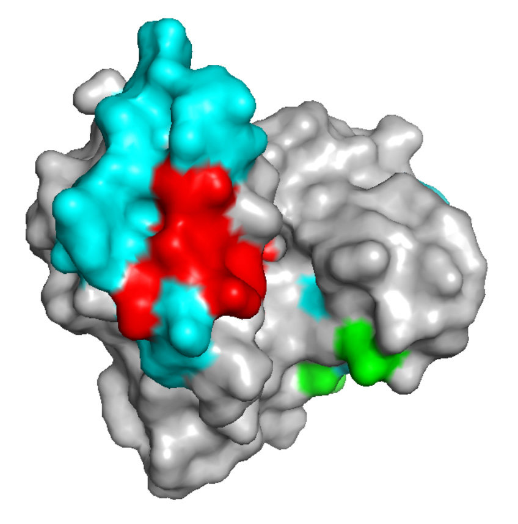

#core/appliedneuroscience

A 3D epitope is not an epitope that happens to have a three-dimensional structure. Every epitope has a shape. A **3D epitope**, also called a conformational or discontinuous epitope, is a binding surface assembled by the fold. The residues that form it need not be neighbours in the sequence. The coloured patches in the figure are that kind of surface.

A linear epitope is a continuous stretch of the chain. Denaturation can leave it intact and destroy a 3D epitope, which is why fixation and processing decide whether an antibody still binds in tissue.

The two receptors do not see the same thing. An antibody can bind the native surface. A T cell receptor binds a processed peptide held in an MHC groove, not the intact fold. Treating them as two readers of one 3D epitope mixes the native surface with the fragment presented from it.
