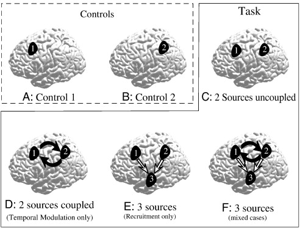

#core/appliedneuroscience

By **comparing brain activity in one condition to another** (such as when a person is performing a task versus when they are at rest), researchers obtain a task-versus-control contrast showing activity associated with that difference. Under the assumptions of pure insertion and additive task effects, the contrast is interpreted as the activity added by the cognitive process of interest. These assumptions, along with the choice and adequacy of the baseline, do not uniquely localise a cognitive process or establish a causal role; violations such as task interactions can change the contrast. This is the principle of cognitive subtraction.
