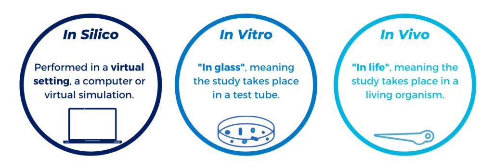

#core/appliedneuroscience

In vivo refers to biological processes **within a living organism**, while in vitro refers to biological processes **outside of a living organism**, such as in a laboratory dish or test tube.

Between the two sits ex vivo: experiments on **living tissues or organs removed from an organism and maintained outside it with minimal alteration**, such as organotypic brain slice cultures or isolated perfused organs. An isolated, artificially perfused whole brain kept functionally alive outside the body is an ex vivo preparation, preserving near-physiological structure without systemic integration.

Each paradigm trades control against extrapolation: in vitro offers maximal control but lacks organismal context; ex vivo preserves tissue architecture but loses circulation, immune and endocrine feedback, and remains viable only for a limited time; in vivo captures full systemic physiology at the cost of experimental accessibility. Another type of process is [In silico](in_silico.md).
