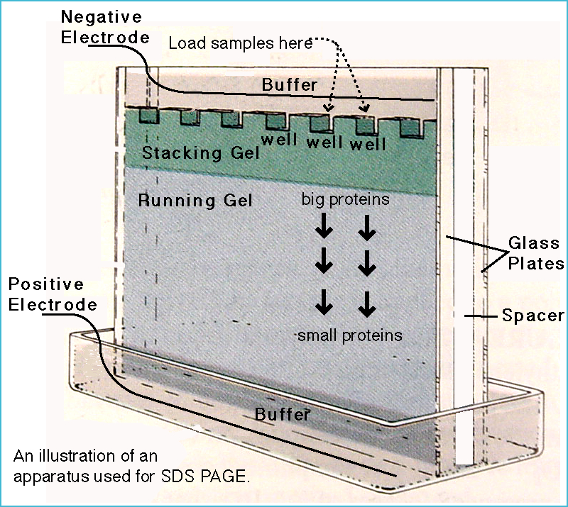

#core/appliedneuroscience

Sodium dodecyl sulphate polyacrylamide gel electrophoresis (SDS-PAGE) is a technique that **separates proteins by size (molecular weight) using an electric field applied across a polyacrylamide gel.** A workhorse of biochemistry and molecular biology, it is often combined with [Western blotting](western_blotting.md) to identify specific proteins.

## Principle

- **Denaturation**: SDS (an anionic detergent) unfolds proteins and coats them with a uniform negative charge proportional to their mass, masking any intrinsic charge; a reducing agent (e.g., β-mercaptoethanol or DTT) breaks disulphide bonds.
- **Sieving**: The polyacrylamide gel acts as a molecular sieve. Since all proteins carry the same charge-to-mass ratio, they all migrate towards the positive electrode (anode); smaller proteins move faster through the gel matrix while larger ones lag behind (see diagram).
- **Discontinuous system**: Gels typically consist of a *stacking gel* (low acrylamide concentration, pH ~6.8) that concentrates samples into sharp bands, followed by a *running (resolving) gel* (higher acrylamide concentration, pH ~8.8) where separation by size occurs.

## Uses

- Determining protein purity
- Estimating molecular weight of proteins (in [kDa](kda_weights.md), by comparison with a ladder of known markers)
- Analysing protein expression in different samples
- Preparing proteins for further analysis, such as [Western blotting](western_blotting.md)

## Typical Workflow

- **Sample preparation**: Proteins are mixed with SDS and a reducing agent, then boiled to ensure complete denaturation.
- **Loading and running**: Samples are loaded into wells in the gel and subjected to electrophoresis until the dye front reaches the bottom.
- **Staining**: Gels are stained (e.g., with Coomassie Blue or silver stain) to visualise protein bands.
- **Analysis**: The pattern of bands is compared with molecular weight markers for identification.
