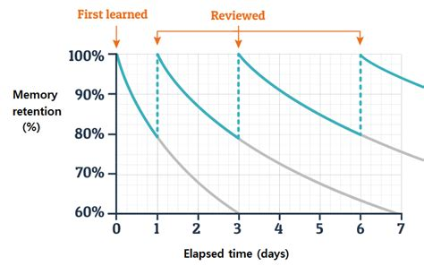

#core/appliedneuroscience

The Ebbinghaus forgetting curve is a **concept in psychology that describes the rate at which information is forgotten over time if it is not actively reviewed or rehearsed.** The curve is named after Hermann Ebbinghaus, a German psychologist who first studied this phenomenon in the late 19th century.

> [!info] Key Insight: Ebbinghaus Forgetting Curve  
> The Ebbinghaus forgetting curve demonstrates that **memory retention declines exponentially** after initial learning—within the first 24 hours, you can lose up to 60% of newly acquired information if it’s not reviewed. Regular review and spaced repetition are essential to slow down this decline and improve long-term retention.

## Method and Caveats

Ebbinghaus measured this using himself as the sole subject, memorising nonsense syllables and testing recall at intervals. Two consequences follow:

- **Nonsense syllables were deliberate** — material free of prior meaning isolates pure retention from the effects of prior knowledge and meaning. Meaningful material decays far more slowly.
- **n = 1** — the exact rates are idiosyncratic to Ebbinghaus; the *shape* (rapid initial loss, then a plateau) replicates robustly, the specific percentages do not generalise.

## The Countermeasure: Spacing

Each successful recall flattens the curve — the next drop is shallower and later. This is the empirical basis of [spaced repetition](../../../001_private/books/short_introduction_to_memory/memory_techniques.md): review at expanding intervals timed to land just before forgetting, so each retrieval succeeds and strengthens [long-term memory](long-term_memory.md). It is also why [online rehearsal](online_rehearsal.md) during encoding and meaningful elaboration both slow the initial decline.

## Related

- [modal model of memory](modal_model_of_memory.md) — the three-store framework within which forgetting occurs (decay from sensory and short-term stores)
- [long-term memory](long-term_memory.md) — what successfully consolidated material becomes
- [online rehearsal](online_rehearsal.md) — the encoding-phase process that slows the curve
- [memory techniques](../../../001_private/books/short_introduction_to_memory/memory_techniques.md) — spaced repetition and mnemonics, the applied countermeasures
- [the seven sins of memory](../../../001_private/books/short_introduction_to_memory/the_seven_sins_of_memory.md) — Schacter's taxonomy of memory failures, including the sin of transience this curve describes
