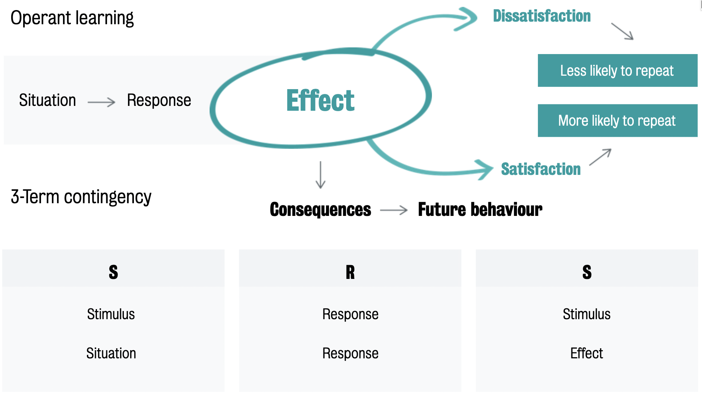

#core/appliedneuroscience

Operant learning, also known as operant conditioning, is a type of learning in which an **individual’s behaviour is modified through the consequences** (rewards or punishments) that follow it. This type of learning was first described by psychologist [B.F. Skinner](https://en.wikipedia.org/wiki/B._F._Skinner) and is based on the idea that behaviours can be strengthened or weakened based on the outcomes that follow them.

## How It Differs from Classical Conditioning

In [classical conditioning](classical_conditioning.md), the learner is passive: a neutral stimulus is paired with an unconditioned one until it elicits a reflexive response. Operant learning is *active* — the organism emits behaviour that operates on the environment, and the consequence of that behaviour determines whether it recurs. Stimulus → response → **consequence** is the operative loop; in classical conditioning there is no consequence term.

## Core Mechanisms

The consequence that follows a behaviour is what shapes it:

- **[Reinforcement](reinforcement_and_reinforcers.md)** — increases the likelihood of a behaviour (positive: adds a pleasant stimulus; negative: removes an unpleasant one)
- **Punishment** — decreases the likelihood of a behaviour
- **[Reinforcement schedules](reinforcement_schedules.md)** — the timing and frequency of reinforcement (continuous, fixed/variable ratio, fixed/variable interval); variable-ratio schedules produce the most persistent behaviour
- **[Extinction](extinction_learning.md)** — previously reinforced behaviour gradually ceases when reinforcement stops

## Related

- [behaviourism](behaviourism.md) — the school this belongs to; Skinner's radical [behaviourism](behaviourism.md) is built on operant principles
- [The operant chamber (Skinner box)](the_operant_chamber_skinner_box.md) — the experimental apparatus for studying it
- [Latent learning](latent_learning.md) — Tolman's challenge: learning occurs even without reinforcement
- [credit assignment problem](../../epfl/credit_assignment_problem.md) — the AI/neuroscience formalisation: which of my actions caused this reward? Operant learning is its behavioural manifestation
- [neutral vs natural stimuli](neutral_vs_natural_stimuli.md) — stimulus classification underlying conditioning paradigms
