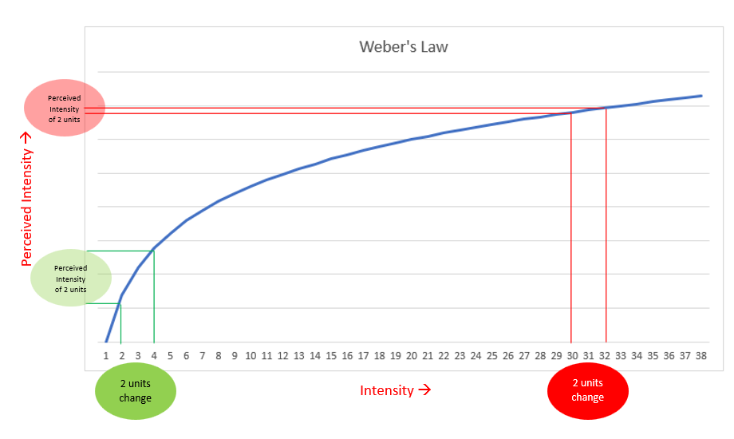

#core/appliedneuroscience

Weber's law is not the Weber–Fechner law, and it is not logarithmic. Ernst Weber's claim is about the **just noticeable difference**: the smallest detectable change in a stimulus is a constant fraction of its intensity.

$$\frac{\Delta I}{I} = k$$

$\Delta I$ is the difference threshold, $I$ the intensity, and $k$ the Weber fraction. A small weight added to a light load is noticeable. The same weight added to a heavy load is not. The absolute size of that difference grows with $I$. The fraction does not.

Taking the logarithm of both sides does not produce a new law. $\log(\Delta I) - \log(I) = \log(k)$ restates $\Delta I = kI$. It does not make the threshold proportional to $\log(I)$.

Gustav Fechner added an assumption Weber did not make: each just noticeable difference is one equal unit of sensation. Integrating $dS = c\,dI/I$ gives Fechner's law, $S = c\log(I/I_0)$. Perceived magnitude grows with the logarithm of intensity. The figure is that curve, mistitled. Equal steps along the horizontal axis are not equal steps in sensation.

The fraction is a mid-range regularity. Near the absolute threshold, and in some modalities across the range, $k$ is not constant.
