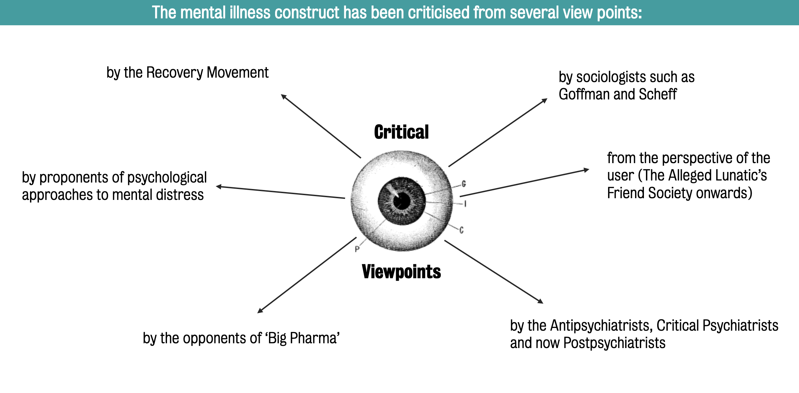

#core/appliedneuroscience

The "mental illness construct" refers to the frameworks through which mental illness is conceptualised — spanning biological, psychological, and sociocultural lenses. For the vocabulary of mental-health terms, see [mental health terminologies](mental_health_terminologies.md).

1. **Medical Model**: This model understands mental illness as primarily a biological phenomenon, often due to chemical imbalances in the brain, genetics, or other physical factors. Treatments in this model usually involve medication, sometimes combined with psychotherapy.

2. **Psychological Model**: This model looks at mental illness as the product of psychological processes. For instance, it may consider how childhood experiences, thoughts, emotions, and behaviours contribute to mental illness. Psychological treatments, such as [cognitive-behavioural therapy](cognitive-behavioural_therapy.md), are common in this model.

3. **Sociocultural Model**: This model emphasises the role of societal and cultural factors in mental illness. It might consider how factors like poverty, discrimination, or societal norms contribute to mental health issues. Solutions in this model often involve changing the social or cultural context and individual treatment.

These constructs significantly affect how society responds to those with mental illnesses, the treatments seen as effective, and how those with mental illnesses see themselves. Constructs vary widely across cultures and societies, and none is wholly sufficient — they are lenses onto different facets of mental health.

A variety of people has criticised this construct:

1. **Sociologists such as Goffman and Scheff**: These sociologists looked at the social construction of mental illness. Goffman, in particular, highlighted the concept of stigma and how it is applied to individuals labelled as mentally ill. On the other hand, Thomas Scheff introduced the idea of “labelling theory,” suggesting that the diagnosis of mental illness can create and reinforce mental illness symptoms due to societal expectations and self-fulfilling prophecies.

2. **From the perspective of the user (The Alleged Lunatic’s Friend Society onwards)**: This perspective often critiques the mental illness model for disempowering patients, treating them as passive recipients of treatment rather than active participants in their care. The Alleged Lunatic’s Friend Society, founded in the 19th century, was an early advocacy group that fought for the rights and dignity of mental health patients. User/Survivor movements nowadays often [stress](stress.md) the importance of patient autonomy, consent, and human rights.

3. **By the Anti-psychiatrists, Critical Psychiatrists, and now Post-psychiatrists**: Anti-psychiatry movements, like those led by figures such as R.D. Laing and Thomas Szasz, critiqued the idea that mental illness can be understood as a purely biological disease. They instead proposed that it might be a sane response to an insane world. Critical psychiatry and post-psychiatry also critique biomedical reductionism and [stress](stress.md) the importance of sociocultural factors and individual experiences.

4. **By the opponents of ‘Big Pharma’**: These critics argue that pharmaceutical companies have too much influence over mental health care. They believe these corporations often prioritise profit over patient well-being, promote medication overuse, and downplay side effects and non-pharmacological interventions.

5. **By proponents of psychological approaches to mental [distress](distress.md)**, These proponents argue for a broader understanding of mental health, including psychological, social, and existential factors. They might critique the mental illness model for being too focused on medication and not enough on psychotherapy, social change, or helping individuals find meaning.

6. **By the Recovery Movement**: The recovery model emphasises that people with mental health conditions can lead meaningful, satisfying lives, even while symptoms might persist. Critics from this perspective argue that the traditional mental illness model is too focused on symptoms and diagnoses rather than on holistic, person-centred care.
