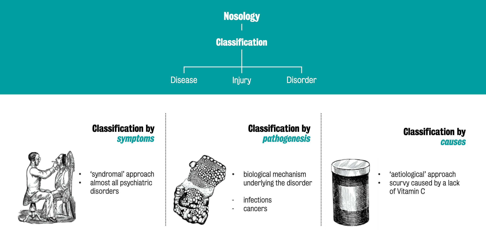

#core/appliedneuroscience

Nosology is the **branch of medical science concerned with the classification and naming of diseases.** The term derives from the Greek *nosos* (disease). It involves systematically studying and categorising conditions based on their characteristics, symptoms, causes, and patterns, providing the organisation and standardisation of disease classification needed for diagnosis, treatment, and research. Classification applies to **disease**, **injury**, and **disorder** alike.

## Approaches to Classification

- **By symptoms — the *syndromal* approach:** Conditions are grouped by their observable clinical presentation. This is the approach used for **almost all psychiatric disorders**, where objective biological markers are typically absent.
- **By pathogenesis:** Conditions are classified by the **biological mechanism underlying the disorder**, as with infections or cancers.
- **By cause — the *aetiological* approach:** Conditions are classified by their underlying cause, as with scurvy resulting from a lack of vitamin C.

## Nosology in Psychiatry

Because most [mental disorders](mental_disorders_overview.md) lack a known pathogenesis or single cause, psychiatric nosology rests almost entirely on the syndromal approach. The two dominant classification systems are the **DSM** (Diagnostic and Statistical Manual of Mental Disorders, APA; currently DSM-5-TR) and the **ICD** (International Classification of Diseases, WHO; currently ICD-11), both of which define categories through clusters of symptoms and duration criteria — see [Mental disorders classifications](mental_disorders_classifications.md). A recognised limitation of this syndromal basis is extensive **comorbidity** and within-category heterogeneity, motivating dimensional alternatives such as the **Research Domain Criteria (RDoC)** framework.
