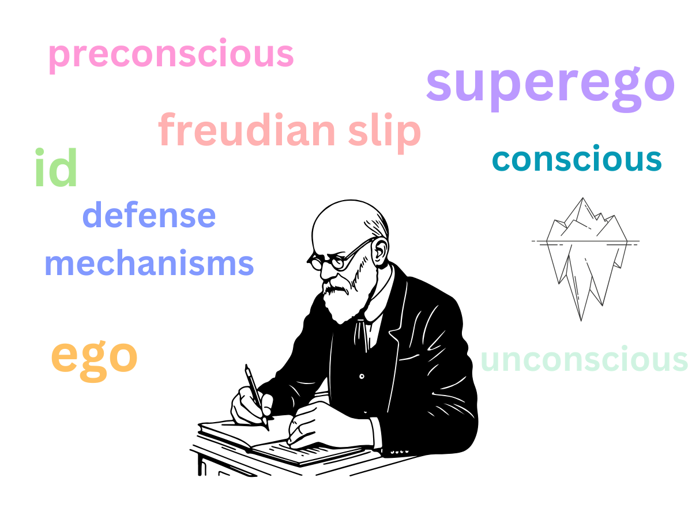

#core/appliedneuroscience

Psychoanalysis, developed by [Sigmund Freud](https://en.wikipedia.org/wiki/Sigmund_Freud) in the late 19th century, is a **therapeutic approach rooted in the idea that individuals are often unaware of many of the factors that influence their emotions and behaviours.** These unconscious factors can create unhappiness, manifesting as seemingly inexplicable feelings, problematic patterns of behaviour, or difficulties in relationships. Through techniques such as dream interpretation, free association, and the analysis of transference, psychoanalysis seeks to uncover these hidden aspects of the psyche in order to understand and resolve psychological problems.

## Models of the Mind

Freud described the mind at two complementary levels, both captured by the iceberg metaphor above:

- **Topographical model:** The mind is layered into the **conscious** (thoughts and perceptions in current awareness), the **preconscious** (memories and knowledge retrievable at will), and the **unconscious** (wishes, fears, and memories kept from awareness as unacceptable or threatening) — the largest, submerged portion of the iceberg.
- **Structural model:** Personality arises from the dynamic interplay of the **id** (instinctual drives seeking immediate gratification), the **ego** (the reality-oriented mediator), and the **superego** (internalised moral standards).

## Key Clinical Concepts

- **Defence mechanisms:** Unconscious strategies the ego uses to manage anxiety and internal conflict, such as repression, denial, and projection.
- **Freudian slip (parapraxis):** Errors of speech or action taken to reveal unconscious thoughts or wishes.
- **Transference:** The patient's redirection of feelings about significant early figures onto the analyst, a central object of interpretation in therapy.

The therapy often involves several sessions a week over several years, allowing the individual and the analyst to dive deep into the complexities of the unconscious mind. It pays particular attention to how early life experiences, especially those involving primary caregivers, shape an individual’s present behaviour, thoughts, and feelings. This introspective process can bring about significant personal growth and self-understanding, helping individuals to lead more fulfilling lives.

Compared to modern therapeutic treatments like [cognitive-behavioural therapy](cognitive-behavioural_therapy.md) (CBT), psychoanalysis requires a greater time commitment and delves deeper into past experiences and unconscious drives.
