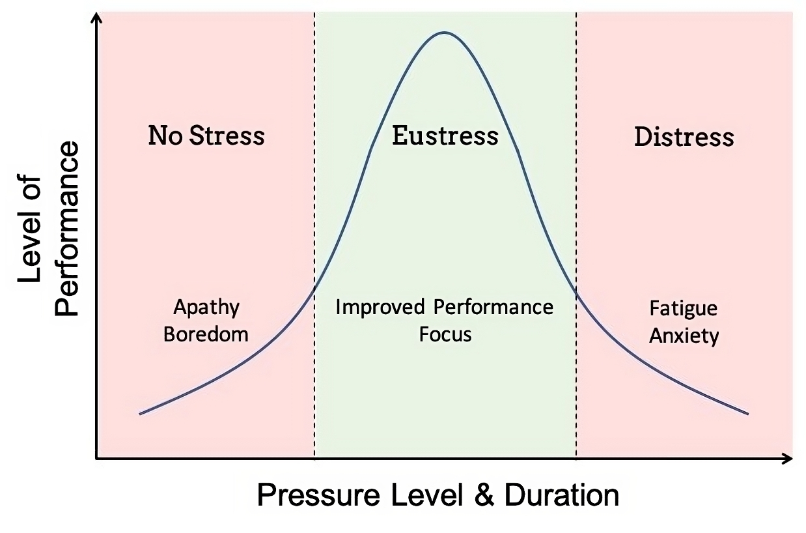

#core/appliedneuroscience

In the field of psychology, "stress" is an umbrella term used to describe the mental, emotional, or physical strain that people experience in response to events perceived as challenging or threatening. This strain can either be positive or negative, and is further categorised by its duration.

## By Valence

- Positive stress — see [eustress](eustress.md)
- Negative stress — see [distress](distress.md)

## By Duration

1. **Acute stress:** The body's immediate reaction to a perceived threat, challenge, or scare — also known as the "fight or flight" response. It is short-lived and typically subsides once the stressor is no longer present.

2. **Chronic stress:** Occurs when a stressful situation continues over a prolonged period, keeping the body's stress response activated. Chronic stress can lead to a variety of health problems, including heart disease, high blood pressure, diabetes, anxiety, and depression.

Stress is a subjective experience influenced by an individual's perception of a situation and their ability to manage or adapt to it. This complexity makes it a key topic of interest in psychology and neuroscience research.

## Stress Response Cluster

- [Eustress](eustress.md): Positive, motivating stress that enhances performance
- [Distress](distress.md): Negative stress that overwhelms coping capacity
- [Diathesis-stress model](diathesis-stress_model.md): Framework explaining how vulnerability factors interact with stressors to produce mental health outcomes
