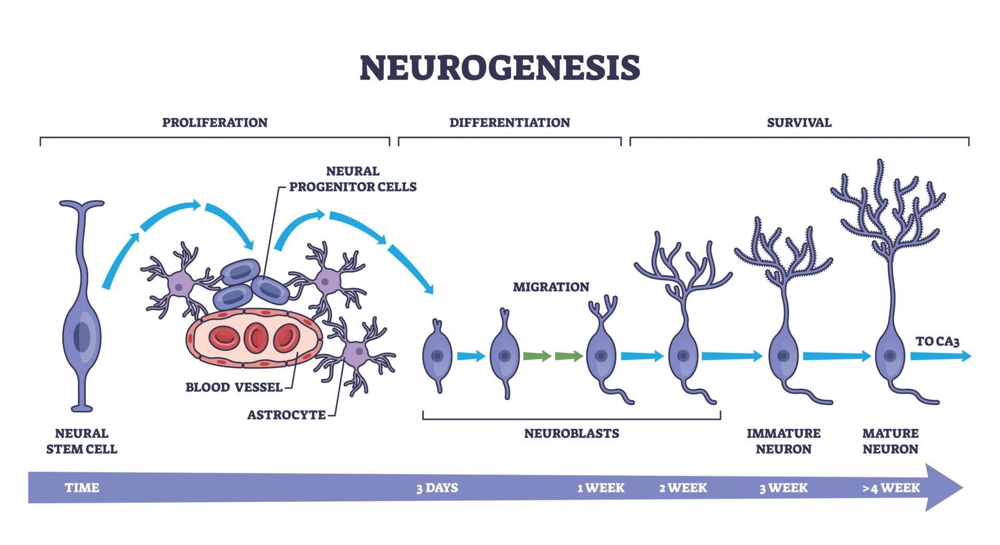

#core/appliedneuroscience

Neurogenesis is the **biological process by which new neurons, or nerve cells, are generated.** It is extensive during prenatal development across many species, including humans. Adult neurogenesis is a more limited and species-, age-, and context-dependent process.

## Historical Context

Historically, it was believed that the human brain was incapable of neurogenesis after birth. Research in animals and humans challenged that simple view, but the evidence is not equivalent across species. In adult rodents, neurogenesis is well-established in the hippocampal dentate gyrus subgranular zone (DG-SGZ) and the lateral-ventricular subventricular zone (SVZ); rates, survival, maturation, and circuit integration vary with species, age, and context. The rodent SVZ–rostral migratory stream–olfactory-bulb pathway should not be treated as established adult human biology.

In adult humans, Dumitru et al. (2025) reported proliferating neural progenitor signatures in the hippocampal dentate gyrus. These signatures were rare and highly variable, and their magnitude and functional significance remain unresolved. They do not establish a universal rate, substantial neuronal replacement, or effective endogenous brain repair. Adult human SVZ-to-olfactory-bulb neurogenesis remains unestablished. Sorrells et al. (2018) reported an absence of detectable adult hippocampal neurogenesis in their material, whereas Boldrini et al. (2018) reported persistence; these findings form part of an ongoing methodological and interpretive controversy rather than a basis for a simple universal conclusion.

## Stages of Neurogenesis

In animal models, the process is commonly described as:

1. **Proliferation**: Neural stem or progenitor cells proliferate to produce daughter cells.
2. **Migration**: Some newly generated cells travel from their birthplace towards a destination.
3. **Differentiation**: Cells acquire neuronal or other specialised identities and develop neuronal structures where appropriate.
4. **Survival and integration**: A subset of new neurons survives and can establish synaptic connections with existing circuits. This is an established animal-model phenomenon, not evidence that human progenitor markers or immature cells necessarily produce substantial circuit integration.

Markers of proliferation, progenitor identity, or immature neurons are not by themselves evidence of mature neuronal replacement, meaningful circuit integration, or functional repair.

## Influencing Factors

In animal models, the survival and maturation of newly generated cells can be influenced by factors including:

- Age
- [Stress](../03_mental_health_in_the_community/stress.md)
- Environment
- Exercise

Injury can alter plasticity and experimental neurogenic responses, but this potential differs from demonstrated endogenous repair of the adult human brain. Therapeutic strategies that aim to enhance or reproduce neurogenic processes therefore remain experimental.

See: [neurogenic niche](../08_advances_in_neuroscience/neurogenic_niche.md) — the anatomical regions that host and support adult neurogenesis

## Sources

- Dumitru et al. (2025), “Identification of proliferating neural progenitors in the adult human hippocampus,” *Science* 389:58–63. [https://doi.org/10.1126/science.adu9575](https://doi.org/10.1126/science.adu9575)
- Sorrells et al. (2018), “Human hippocampal neurogenesis drops sharply in children to undetectable levels in adults,” *Nature* 555:377–381. [https://doi.org/10.1038/nature25975](https://doi.org/10.1038/nature25975)
- Boldrini et al. (2018), “Human Hippocampal Neurogenesis Persists throughout Aging,” *Cell Stem Cell* 22:589–599.e5. [https://doi.org/10.1016/j.stem.2018.03.015](https://doi.org/10.1016/j.stem.2018.03.015)
